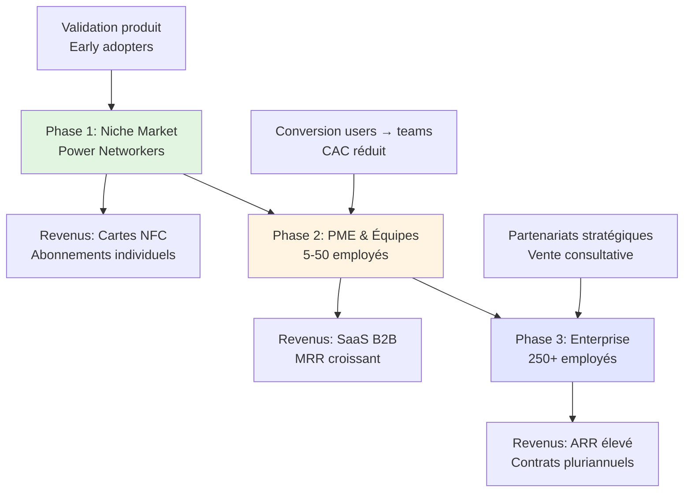

# Stratégie, Positionnement, Enjeux et Risques
## Dossier Complémentaire - Weavink (Tapit SAS)

---

## 1. STRATÉGIE COMMERCIALE

### 1.1 Approche Progressive de Conquête de Marché

Notre stratégie repose sur une approche **"bottom-up"** en trois phases distinctes, permettant de valider notre modèle et de construire une base solide avant d'attaquer des segments plus complexes.



#### Phase 1 (Année 1-2): Pénétration du Marché Niche
**Cible:** Freelances, commerciaux, consultants, recruteurs - les "power networkers"

**Objectifs:**
- 500 cartes NFC vendues (Y1)
- 150 abonnements SaaS actifs
- Validation du product-market fit
- Construction d'une base d'utilisateurs ambassadeurs

**Stratégie d'acquisition:**
- Salons professionnels et événements BNI (3 invitations confirmées)
- Réseau MEDEF et TARMAC (7 opportunités actuelles)
- Marketing de contenu ciblé (LinkedIn, cas d'usage)
- Programme de parrainage agressif (20% de réduction)

**Avantages:**
- Cycle de vente court (1-4 semaines)
- CAC maîtrisé (150-300€ par client)
- Feedback rapide pour itération produit
- Construction de cas clients B2C pour crédibilité B2B

#### Phase 2 (Année 2-3): Montée en Gamme PME
**Cible:** Équipes commerciales, agences marketing, cabinets de recrutement (5-50 personnes)

**Objectifs:**
- 50 comptes entreprises actifs
- MRR de 15 000€ (fin Y2)
- Taux de conversion individual→team de 25%

**Stratégie d'acquisition:**
- **Upsell stratégique:** Conversion des utilisateurs individuels satisfaits en prescripteurs internes
- Vente directe B2B via réseau construit en Phase 1
- Partenariats avec distributeurs de cartes NFC existants
- Démos personnalisées et POCs (Proof of Concept)

**Avantages clés de notre approche:**
- **CAC divisé par 3** par rapport à l'acquisition cold: un utilisateur individuel qui recommande Weavink à sa direction a déjà validé le produit
- Cycle de vente réduit (4-8 semaines vs 12-24 semaines en cold)
- Taux de rétention supérieur (les équipes ayant déjà un champion interne)

#### Phase 3 (Année 3+): Expansion Enterprise
**Cible:** Moyennes et grandes entreprises (250+ employés), notamment secteurs conseil, tech, finance

**Objectifs:**
- 10 comptes enterprise actifs
- ARR moyen de 50 000€ par compte
- Partenariats stratégiques avec éditeurs CRM

**Stratégie d'acquisition:**
- Vente consultative avec POCs étendus
- Partenariats technologiques (intégrations Salesforce, Microsoft Dynamics)
- Présence dans les appels d'offres
- Marketing ABM (Account-Based Marketing)

---

### 1.2 Stratégie de Différenciation Produit

Notre positionnement unique repose sur **trois piliers technologiques** qui nous distinguent radicalement de la concurrence:

```
┌─────────────────────────────────────────────────────────────────┐
│                    CONCURRENTS                                  │
│  ┌──────────────────────────────────────────────────┐          │
│  │  Carte NFC + Profil Digital = "Link-in-bio"     │          │
│  │  ✓ Partage de contacts                           │          │
│  │  ✓ Stockage statique                             │          │
│  │  ✗ Pas d'intelligence                            │          │
│  └──────────────────────────────────────────────────┘          │
└─────────────────────────────────────────────────────────────────┘

                              VS

┌─────────────────────────────────────────────────────────────────┐
│                        WEAVINK                                  │
│  ┌──────────────────────────────────────────────────┐          │
│  │  Carte NFC + Plateforme IA = "Relationship       │          │
│  │                              Intelligence"        │          │
│  │  ✓ Partage de contacts                           │          │
│  │  ✓ Gestion intelligente du réseau                │          │
│  │  ✓ Recherche sémantique                          │          │
│  │  ✓ Groupement proactif par IA                    │          │
│  │  ✓ Insights et recommandations                   │          │
│  │  ✓ Sécurité enterprise-grade                     │          │
│  └──────────────────────────────────────────────────┘          │
└─────────────────────────────────────────────────────────────────┘
```

**Pilier 1: Intelligence Relationnelle Propriétaire**
- **Recherche sémantique vectorielle** (Pinecone): "Qui connais-je dans la fintech à Paris?" vs recherche par mot-clé
- **Groupement proactif par IA** (Gemini): Détection automatique de clusters pertinents ("anciens collègues chez X", "contacts Salon Y")
- **Graphe de connaissances**: Visualisation des relations et chemins d'introduction optimaux

**Pilier 2: Architecture Sécurisée Enterprise-Ready**
- Conformité RGPD by design (hébergement EU, chiffrement E2E)
- Permissions granulaires (4 niveaux: Contacts, Équipe, Admin, Organisation)
- Audit trail complet de toutes les actions sensibles
- Intégrations natives CRM et outils enterprise (Salesforce, Microsoft, SAP)

**Pilier 3: Modèle Économique Hybride**
- **Produit d'appel tangible** (carte NFC premium): Crée l'effet "wow" et ouvre la porte
- **Valeur récurrente** (plateforme SaaS): Capture la valeur dans la durée via l'abonnement
- **Expansion revenue**: Les cartes génèrent des revenus immédiats, le SaaS construit l'ARR

---

### 1.3 Stratégie de Monétisation

```
Modèle Économique Hybride
═══════════════════════════

HARDWARE (One-time)          SOFTWARE (Recurring)
┌──────────────┐            ┌──────────────────┐
│ Cartes NFC   │            │ Abonnements SaaS │
│              │            │                  │
│ • PVC: 30€   │───────────▶│ • Base: Gratuit  │
│ • Bois: 40€  │ Onboarding │ • Pro: 9€/mois   │
│ • Métal: 50€ │            │ • Premium: 19€/m │
│              │            │ • Business: 39€/m│
│ Marge: 80%+  │            │ • Enterprise:    │
│              │            │   Sur-mesure     │
└──────────────┘            └──────────────────┘
       ↓                            ↓
  Revenu immédiat            Revenu récurrent
  Flux de trésorerie         Construction ARR
```

**Année 1-2:** Revenus majoritairement hardware (70% cartes / 30% SaaS)
- Financement de la croissance par vente de cartes
- Construction progressive de la base MRR

**Année 2-3:** Équilibrage du mix (50% / 50%)
- Conversion accélérée vers abonnements
- Focus sur la rétention et l'expansion

**Année 3+:** Bascule vers le SaaS (30% cartes / 70% SaaS)
- Modèle récurrent stable et prévisible
- Marges SaaS supérieures (85%+)

---

### 1.4 Stratégie de Partenariat

**Partenariats Technologiques:**
- **Éditeurs CRM** (Salesforce, HubSpot, Zoho): Intégrations natives, marketplace presence
- **Fournisseurs cartes NFC** (NFC Touch, MoreRFID): Négociation volumes, co-branding
- **Hébergeurs Cloud** (AWS, Azure): Crédits startups, infrastructure scalable

**Partenariats Commerciaux:**
- **Réseaux d'accompagnement** (TARMAC, MEDEF, BNI): Accès aux entrepreneurs et commerciaux
- **Écoles de commerce/ingénieurs**: Offres étudiantes, acquisition early adopters
- **Organisateurs d'événements**: Parrainage, démonstrations live

**Objectif:** Réduire le CAC de 40% via ces canaux indirects d'ici fin Y2

---

## 2. POSITIONNEMENT STRATÉGIQUE

### 2.1 Positionnement Concurrentiel

#### Matrice de Positionnement

```
        │
    É   │                    ╔═══════════════╗
    L   │                    ║   WEAVINK     ║
    E   │                    ║ (Relationship ║
    V   │                    ║ Intelligence) ║
    É   │                    ╚═══════════════╝
        │          
    I   │    ┌──────────┐         
    N   │    │ LinkedIn │         ┌──────────┐
    T   │    │ Premium  │         │ HubSpot  │
    E   │    └──────────┘         │Salesforce│
    L   │                         └──────────┘
    L   │  ┌─────────┐  ┌─────────┐
    I   │  │ WEMET   │  │ Cardynale│
    G   │  │ VKARD   │  │ Mobilo  │
    E   │  └─────────┘  └─────────┘
    N   │ ┌──────────┐
    C   │ │ Cartes   │
    E   │ │ papier   │
        │ └──────────┘
    ─   └─────────────────────────────────────
        BAS      MOYEN      ÉLEVÉ    TRÈS ÉLEVÉ
                     PRIX
```

**Notre positionnement:**
- **Prix:** Premium mais justifié (19-89€/mois vs 39-80€/mois LinkedIn Premium)
- **Intelligence:** Très élevée (seul acteur avec IA propriétaire + graphe de connaissances)
- **Segment:** Nous ne sommes PAS sur le marché des "cartes de visite", mais sur celui de la "gestion intelligente du réseau professionnel"

### 2.2 Proposition de Valeur Unique

```
┌────────────────────────────────────────────────────────┐
│            POUR: Professionnels ambitieux              │
│            QUI: Considèrent leur réseau comme un       │
│                 actif stratégique de carrière          │
│                                                         │
│         WEAVINK est: Un co-pilote IA du networking     │
│                                                         │
│            QUI: Transforme le chaos relationnel en     │
│                 intelligence exploitable                │
│                                                         │
│   CONTRAIREMENT À: WEMET, Cardynale, Mobilo           │
│                    (simple stockage de contacts)       │
│                                                         │
│      NOTRE PRODUIT: Comprend, structure et valorise    │
│                     votre réseau grâce à l'IA         │
└────────────────────────────────────────────────────────┘
```

### 2.3 Messages Clés par Segment

**B2C (Freelances, Commerciaux):**
- *"Arrêtez de perdre des opportunités dans votre carnet d'adresses"*
- *"Votre réseau vaut de l'or. Weavink le révèle."*
- Bénéfice: Retrouver instantanément "qui connais-je qui peut m'aider sur X?"

**B2B SME (Équipes 5-50):**
- *"Transformez votre réseau d'équipe en avantage concurrentiel"*
- *"Le CRM gère vos clients. Weavink gère votre réseau."*
- Bénéfice: Collaboration seamless, leads partagés, pas de perte de contacts si départ employé

**B2B Enterprise (250+):**
- *"Une plateforme enterprise-grade de relationship intelligence"*
- *"Sécurisez et valorisez le capital relationnel de votre organisation"*
- Bénéfice: Conformité RGPD, intégration IT, ROI mesurable sur le networking

---

## 3. ENJEUX MAJEURS

### 3.1 Enjeu #1: Adoption du Marché et Éducation

**Problématique:**
Le marché des cartes NFC est émergent (24,65M$ en 2024) avec seulement **35% des professionnels** ayant adopté des alternatives NFC. La majorité du marché ne connaît pas encore cette technologie.

**Impact:**
- Nécessité d'éduquer le marché = coûts marketing élevés
- Cycles de vente allongés pour B2B (besoin de démos, POCs)
- Risque de perception "gadget" plutôt que "outil professionnel"

**Notre Réponse:**
1. **Effet "wow" physique:** Les cartes métalliques créent un moment marquant qui déclenche la conversation
2. **Stratégie de contenus:** Cas d'usage concrets, ROI calculé, témoignages clients
3. **Partenariats prescripteurs:** BNI, MEDEF, écoles = validation par des tiers de confiance
4. **Approche bottom-up:** Les early adopters individuels deviennent nos évangélistes internes dans les entreprises

**Indicateurs de succès:**
- Taux de conversion démo → vente: >25% (actuellement ~30% sur nos 7 premiers prospects)
- NPS (Net Promoter Score): >50
- Taux de parrainage: >15% des clients apportent 1+ nouveau client

---

### 3.2 Enjeu #2: Passage du Hardware au SaaS Récurrent

**Problématique:**
Notre modèle nécessite une transition progressive d'un business transactionnel (vente de cartes) vers un modèle d'abonnement récurrent.

```
Transition de Modèle Économique
════════════════════════════════

Année 1              Année 2              Année 3
─────────            ─────────            ─────────
   70%                  50%                  30%      Hardware
   ▓▓▓▓▓▓▓              ▓▓▓▓▓                ▓▓▓      (one-time)
   
   30%                  50%                  70%      Software
   ░░░                  ░░░░░                ░░░░░░   (recurring)


Risque: La "vallée de la mort" du SaaS
       (charges fixes SaaS + revenus encore hardware-dépendants)
```

**Impact:**
- **Flux de trésorerie:** Les revenus hardware financent le court terme, mais les charges SaaS (serveurs, API, équipe tech) sont récurrentes
- **Évaluation:** Les investisseurs valorisent l'ARR (revenus récurrents) 5-10x plus que les revenus one-time
- **Prédictibilité:** Nécessité d'avoir des métriques SaaS solides (MRR, Churn, LTV/CAC) pour lever des fonds

**Notre Réponse:**
1. **Onboarding automatisé:** Chaque achat de carte = inscription gratuite automatique à la plateforme
2. **Time-to-value court:** L'utilisateur voit la valeur de l'IA en <7 jours
3. **Expansion revenue:** 
   - Upsell Pro après 30 jours d'utilisation intensive
   - Conversion team dès que 2+ collègues utilisent le produit
4. **Pricing psychologique:** 9€/mois = prix d'un déjeuner, facile à justifier

**Indicateurs de succès:**
- Taux d'activation (carte achetée → compte actif): >80%
- Taux de conversion gratuit → payant: >20% à 90 jours
- Churn mensuel: <3% (SaaS B2C), <2% (B2B)
- Expansion MRR: >15% (upsells et ajouts de sièges)

---

### 3.3 Enjeu #3: Construction des Effets de Réseau

**Problématique:**
Contrairement à LinkedIn qui bénéficie d'un effet de réseau naturel ("tout le monde est sur LinkedIn"), nous devons construire notre propre effet de réseau.

```
Effet de Réseau Weavink
══════════════════════

Valeur                    ↗ Effet de réseau fort
pour                   ↗
l'utilisateur       ↗
                 ↗
              ↗          Seuil de viralité
           ↗            (≈15% de pénétration
        ↗↗              dans une organisation)
     ─────────
     
     ────────────────────────────────────────▶
     Nombre d'utilisateurs dans le réseau
```

**Impact:**
- Un utilisateur isolé a peu de valeur
- La valeur explose quand son équipe/réseau adopte Weavink
- Risque de "chicken-and-egg": pourquoi adopter si personne d'autre ne l'utilise?

**Notre Réponse:**
1. **Valeur immédiate standalone:** La recherche sémantique et l'IA fonctionnent même avec 0 autre utilisateur
2. **Import facilité:** Synchronisation Google Contacts, LinkedIn, CSV = base immédiate de 500-2000 contacts
3. **Viral loops intégrés:**
   - Chaque profil partagé = exposition de la marque
   - Invitations en équipe = réduction tarifaire
   - Tableau de bord "réseau commun" = incitation à inviter des collègues
4. **Focus géographique initial:** Saturation Grenoble/Lyon avant d'étendre = masse critique locale

**Indicateurs de succès:**
- K-factor (viralité): >0.5 (chaque utilisateur amène 0.5 nouveau utilisateur organiquement)
- Taux d'adoption intra-entreprise: >30% après le premier champion
- Temps pour atteindre masse critique dans une organisation: <6 mois

---

### 3.4 Enjeu #4: Compétition et Réponse des Acteurs Établis

**Problématique:**
Le marché attire de plus en plus d'acteurs:
- **Concurrents directs français** (WEMET, VKARD, Cardynale) sont bien établis
- **Players internationaux** (Mobilo, Popl) ont levé des millions
- **Risque de commoditization:** Les cartes NFC deviennent un produit banal

**Impact:**
- Pression sur les prix (course vers le bas)
- Nécessité d'investir massivement en marketing pour se différencier
- Risque de copie de nos features IA par des acteurs mieux financés

**Notre Réponse:**
1. **Différenciation durable par la tech:**
   - Notre moteur d'IA est propriétaire et complexe à répliquer
   - 12 mois d'avance technologique minimum
   - Brevets en cours de dépôt sur algorithmes de groupement proactif

2. **Positionnement premium assumé:**
   - Nous ne jouons PAS sur le prix le plus bas
   - Focus sur ROI et valeur ajoutée vs coût
   - Enterprise-grade = barrière à l'entrée pour petits concurrents

3. **Stratégie de "land and expand":**
   - Une fois une équipe adoptée, switching cost élevé
   - Network effect propriétaire dans chaque organisation
   - Données relationnelles = actif unique et non transférable

4. **Partenariats stratégiques:**
   - Alliances avec éditeurs CRM = distribution + crédibilité
   - Co-développement avec grands comptes = features exclusives

**Indicateurs de succès:**
- Part de marché France: >5% d'ici fin Y3
- Taux de désabonnement concurrentiel: <10% des churns dus à un concurrent
- NRR (Net Revenue Retention): >110% (expansion > churn)

---

### 3.5 Enjeu #5: Scaling de l'Équipe et de l'Infrastructure

**Problématique:**
Notre croissance projetée nécessite une montée en charge significative:

```
Croissance d'Équipe Projetée
═════════════════════════════

Année 1        Année 2        Année 3
─────────      ─────────      ─────────
2 pers.        5 pers.        10-12 pers.
(fondateurs)   
                              
                ├─ Dev Full-Stack   ├─ Dev Backend (×2)
                ├─ Commercial       ├─ Dev Frontend
                └─ Customer Success ├─ Sales (×2)
                                     ├─ CSM (×2)
                                     ├─ Marketing
                                     └─ Ops/Finance
```

**Impact:**
- **Culture d'entreprise:** Risque de perte de vision et de vélocité avec la croissance
- **Recrutement:** Difficulté à attirer des talents tech dans un écosystème compétitif (Grenoble vs Paris)
- **Management:** Passage de "faire" à "faire faire" = nouvelle compétence pour les fondateurs

**Notre Réponse:**
1. **Recrutement progressif et qualité:**
   - Privilégier freelances/contractors Y1-Y2 pour tester avant CDI
   - Partenariats écoles Grenoble INP, emlyon pour stages/alternances
   - Remote partiel pour élargir le pool de candidats

2. **Onboarding structuré:**
   - Documentation technique exhaustive
   - Pair programming systématique premières semaines
   - Culture écrite (RFCs, ADRs) pour scalabilité asynchrone

3. **Infrastructure scalable dès le départ:**
   - Architecture microservices (permet de paralléliser le dev)
   - CI/CD automatisé (limite la dette technique)
   - Monitoring proactif (anticipation des problèmes avant qu'ils impactent clients)

4. **Formation continue fondateurs:**
   - Mentorat via TARMAC/MEDEF
   - Participation programmes type YCombinator Startup School
   - Board d'advisors avec entrepreneurs expérimentés

**Indicateurs de succès:**
- Time-to-productivity nouvelles recrues: <30 jours
- Turnover équipe: <10% annuel
- Employee NPS: >40
- Ratio revenues/employé: >80k€ dès Y3

---

## 4. ANALYSE DES RISQUES

### 4.1 Cartographie Globale des Risques

```
Matrice Impact vs Probabilité
═══════════════════════════════

     │
 ÉLE │  [R2]        [R5]        [R1]
  V  │  RGPD/       Compét.     Tech
  É  │  Sécu        IA          (NFC)
     │
  I  │              [R4]        [R3]
  M  │              CAC/        Scaling
  P  │              Churn       équipe
  A  │
  C  │  [R8]        [R7]        [R6]
  T  │  Supply      Dépend.     Market
     │  chain       Cloud       timing
     │
 FAI │
  B  │
  L  │
  E  │
     └─────────────────────────────────
       FAIBLE    MOYENNE    ÉLEVÉE
               PROBABILITÉ

Légende Couleurs:
🔴 Risque critique - Action immédiate
🟠 Risque important - Plan de mitigation
🟡 Risque modéré - Surveillance
🟢 Risque faible - Accepté
```

---

### 4.2 RISQUES TECHNIQUES

#### 🔴 RISQUE T1: Compatibilité et Fiabilité NFC

**Description:**
Bien que 78% des smartphones supportent le NFC, il existe des variations importantes de performance selon les modèles et les OS. Des utilisateurs peuvent avoir une expérience dégradée voire des échecs de lecture.

**Probabilité:** **ÉLEVÉE** (30-40% des utilisateurs rencontreront au moins un échec)
**Impact:** **ÉLEVÉ** (Frustration utilisateur, avis négatifs, retours produits)

**Sources:**
- 22% des smartphones ne supportent pas le NFC (marché 2025)
- 43% des utilisateurs corporate reportent des difficultés d'intégration avec systèmes legacy
- iPhone <13 ont des performances NFC dégradées

**Scénarios d'impact:**
- Utilisateur essaie de partager sa carte lors d'un événement important → échec → perte de crédibilité professionnelle
- Client B2B équipe son équipe → 30% des téléphones incompatibles → insatisfaction et churn

**Mitigation:**
1. **Plan B technologique: QR code systématique**
   - Chaque carte NFC intègre AUSSI un QR code
   - Compatibilité universelle (100% des smartphones récents)
   - UX: "Approchez pour NFC, ou scannez le QR"

2. **Test de compatibilité à l'onboarding**
   - L'app teste la capacité NFC du téléphone lors de la première utilisation
   - Alerte proactive si téléphone incompatible
   - Proposition d'alternatives (QR, partage par lien)

3. **Monitoring qualité en temps réel**
   - Tracking des taux de succès/échec NFC par modèle de téléphone
   - Alertes automatiques si taux d'échec >15% sur un segment
   - Amélioration continue firmware des cartes

4. **Support client réactif**
   - Base de connaissance: "Mon NFC ne fonctionne pas"
   - Remplacement gratuit des cartes défectueuses
   - Formation utilisateurs sur les "best practices" NFC

**Indicateur de surveillance:**
- Taux de succès NFC: >85% objectif, alerte si <80%
- Taux de retours/réclamations: <5%

**Coût de mitigation:** 5 000€ (QR codes déjà inclus) + 1h/semaine monitoring

---

#### 🟠 RISQUE T2: Précision et Biais de l'IA

**Description:**
Nos algorithmes d'IA (recherche sémantique, groupement proactif) peuvent:
- Produire des résultats non pertinents
- Créer des groupes incohérents
- Introduire des biais (sexe, origine, etc.)

**Probabilité:** **MOYENNE** (20-30% des requêtes complexes auront des résultats sous-optimaux initialement)
**Impact:** **ÉLEVÉ** (Perte de confiance dans l'IA, downgrade vers version manuelle, churn)

**Sources:**
- Modèles LLM type Gemini ont ~15% d'erreur sur tâches complexes
- Embeddings vectoriels nécessitent fine-tuning domaine spécifique
- Risque de biais documenté dans tous les modèles d'IA publics

**Scénarios d'impact:**
- Un utilisateur cherche "consultants RH région parisienne" → l'IA retourne des résultats hors-sujet → frustration
- Le groupement automatique crée un cluster "Contacts féminins" → biais sexiste évident → bad PR

**Mitigation:**
1. **Approche hybrid human-in-the-loop**
   - L'IA suggère, l'utilisateur valide/corrige
   - Feedback loop: chaque correction améliore le modèle
   - Option "mode manuel" toujours disponible

2. **Fine-tuning continu**
   - Dataset propriétaire construit depuis les interactions users
   - Ré-entraînement mensuel des modèles
   - A/B testing de nouvelles versions (90/10 split)

3. **Audit anti-biais systématique**
   - Tests automatisés pré-production
   - Revue manuelle trimestrielle par cabinet externe
   - Politique de transparence (communication des biais identifiés)

4. **Confidence scoring visible**
   - Chaque résultat IA affiche un score de confiance
   - Alerte si confiance <70%: "Résultat approximatif, valider manuellement"

5. **Contrôles éthiques:**
   - Comité d'éthique IA (inclut un membre externe)
   - Interdiction de groupements sur critères protégés (race, religion, genre)
   - Audit trails de toutes les décisions IA

**Indicateur de surveillance:**
- Taux de satisfaction recherche sémantique: >80% (enquête mensuelle)
- Taux de correction groupes auto: <20%
- Incidents biais rapportés: 0

**Coût de mitigation:** 15 000€/an (audits externes) + 0.5 ETP data scientist

---

#### 🟡 RISQUE T3: Dépendance Infrastructure Cloud

**Description:**
Notre stack technique repose sur des services tiers critiques:
- **Pinecone** (base vectorielle)
- **Google Gemini / OpenAI** (LLMs)
- **Firebase** (backend, auth, database)
- **AWS/Vercel** (hosting)

**Probabilité:** **FAIBLE** (ces providers sont ultra-fiables, mais pannes possibles)
**Impact:** **ÉLEVÉ** (service indisponible = perte revenus + insatisfaction)

**Scénarios d'impact:**
- Pinecone a une panne de 6h → recherche sémantique indisponible → users ne peuvent plus chercher contacts
- Firebase outage → app complètement down → perte de crédibilité
- API Gemini rate-limited → features IA dégradées

**Mitigation:**
1. **Architecture résiliente multi-provider:**
   - Plan de basculement Pinecone → Weaviate (self-hosted) en <24h
   - Fallback LLM: Gemini → OpenAI → Claude (3 providers)
   - Data replication Firebase → backup PostgreSQL quotidien

2. **Mode dégradé gracieux:**
   - Si Pinecone down → fallback recherche PostgreSQL full-text (moins performant mais fonctionnel)
   - Si LLM down → désactivation temporaire features IA avancées, fonctions core maintenues

3. **Monitoring et alerting proactif:**
   - Uptime monitoring (Pingdom/UptimeRobot)
   - Alertes SMS fondateurs si downtime >5 min
   - Status page publique (status.weavink.io)

4. **SLA contractuels:**
   - Négociation SLA 99.9% avec Pinecone (Enterprise plan)
   - Crédits automatiques si SLA non respecté
   - Assurance cyber-risque (couverture perte d'exploitation)

**Indicateur de surveillance:**
- Uptime global: >99.5% objectif (4h downtime max/an)
- MTTR (Mean Time To Recovery): <30 minutes

**Coût de mitigation:** 2 000€/mois (plans Enterprise + assurance)

---

### 4.3 RISQUES DE MARCHÉ

#### 🔴 RISQUE M1: Commoditization du Marché NFC

**Description:**
Le marché des cartes NFC pourrait devenir un produit banalisé, avec une guerre des prix et une érosion des marges. Les concurrents existants (WEMET, Cardynale) pourraient baisser drastiquement leurs prix.

**Probabilité:** **ÉLEVÉE** (déjà observée dans autres pays, notamment Asie)
**Impact:** **TRÈS ÉLEVÉ** (compression marges, impossibilité de financer le développement SaaS)

**Sources:**
- En Chine, cartes NFC disponibles à 5-10$ (production de masse)
- WEMET vend déjà des cartes PVC à 50€ HT, marge faible
- Barrières à l'entrée faibles pour production hardware

**Scénarios d'impact:**
- Concurrent lance une offre à 19€ la carte NFC → pression immédiate sur notre pricing
- Marché saturé → acquisition costs explosent, ROI négatif sur hardware
- Perception "carte NFC = gadget low-cost" → dévalorisation de notre offre premium

**Mitigation:**
1. **Pivot rapide vers Software-first (déjà planifié):**
   - Objectif: 70% des revenus en SaaS d'ici Y3
   - Cartes deviennent un "loss leader" ou à marge nulle
   - La vraie valeur = plateforme IA

2. **Différenciation qualitative hardware:**
   - Design premium incomparable (collaboration designer professionnel)
   - Matériaux haut de gamme (métal brossé, bois certifié FSC)
   - Packaging luxury (boîte magnétique, expérience unboxing)
   - → Positionnement "carte de luxe" vs "produit de masse"

3. **Bundle hardware + software indissociable:**
   - Prix carte inclut 3 mois d'abonnement Premium offerts
   - Activation obligatoire → onboarding automatique sur SaaS
   - Valeur perçue augmentée (carte + software = package complet)

4. **Programme de fidélité et lock-in:**
   - Renouvellement carte tous les 2 ans (technologie NFC évolue)
   - Cartes "collector" pour early adopters
   - Statut VIP pour clients long-terme

**Indicateur de surveillance:**
- Prix moyen marché cartes NFC (veille concurrentielle mensuelle)
- Part des revenus SaaS: >40% dès Y2, >60% Y3
- Marge brute globale: >70% maintenue

**Coût de mitigation:** Intégré (accélération roadmap SaaS)

---

#### 🟠 RISQUE M2: Réaction Agressive des Concurrents

**Description:**
WEMET (leader français, 700k€ CA), VKARD ou Mobilo (US, millions levés) pourraient:
- Copier nos features IA
- Mener une guerre des prix agressive
- Lever massivement pour nous étouffer

**Probabilité:** **MOYENNE** (inévitable si nous gagnons traction, timing incertain)
**Impact:** **ÉLEVÉ** (difficultés d'acquisition clients, pression sur pricing, course aux fonds)

**Sources:**
- WEMET prépare levée de fonds pour expansion (public dans leur communication)
- Mobilo (US) a des features similaires en beta
- Cycle d'innovation court dans le SaaS (6-12 mois pour copier une feature)

**Scénarios d'impact:**
- WEMET sort une feature "recherche intelligente" → érosion de notre USP
- Mobilo lance en France avec 2M$ de marketing → saturation du marché
- Guerre des prix → tous les acteurs baissent prix → compression marges

**Mitigation:**
1. **Vitesse d'innovation supérieure:**
   - Roadmap produit agressive: 1 feature majeure/mois
   - Timeboxing strict: MVP en 2 semaines, amélioration continue
   - Culture "ship fast, learn faster"

2. **Protection IP stratégique:**
   - Dépôt de brevets sur algorithmes IA propriétaires (en cours)
   - Marques déposées (Weavink™, Tapit™)
   - Accords de confidentialité béton avec tous employés/contractors

3. **Acquisition de talents stratégiques:**
   - Recruter les meilleurs data scientists français
   - Packages attractifs (equity généreuse) pour limiter débauche

4. **Partenariats exclusifs:**
   - Accords avec organisateurs événements (salons, conférences)
   - Partenariats écoles/universités (offres étudiantes exclusives)
   - Co-development avec 2-3 grands comptes (features custom = moat)

5. **Stratégie de levée préemptive:**
   - Lever 500k€-1M€ dès traction confirmée (fin Y1/début Y2)
   - Financement d'une longueur d'avance sur concurrents locaux
   - Permet d'investir massivement en R&D et marketing avant réaction concurrents

**Indicateur de surveillance:**
- Veille concurrentielle hebdomadaire (features, pricing, levées)
- Part de voix (SOV) marketing: maintenir >15% vs WEMET
- Temps de copie d'une feature: objectif que concurrent mette >9 mois

**Coût de mitigation:** 50 000€/an (brevets, veille, legal) + coût levée (dilution)

---

#### 🟡 RISQUE M3: Timing de Marché (Too Early / Too Late)

**Description:**
Deux scénarios opposés:
- **Too early:** Le marché n'est pas prêt, adoption trop lente, cash burn avant product-market fit
- **Too late:** Le marché est déjà saturé, concurrents bien installés, difficile de se différencier

**Probabilité:** FAIBLE-MOYENNE (indicateurs actuels positifs mais marché imprévisible)
**Impact:** **MODÉRÉ** (nécessiterait pivot ou ajustement stratégie)

**Éléments de contexte:**
- Marché NFC business cards: croissance 12.5% CAGR (2024-2033)
- 35% professionnels ont déjà adopté NFC → marché early majority
- Mais: 65% encore sur papier → large potentiel

**Scénarios d'impact:**
- Too early: Burn 200k€ en 18 mois sans traction → levée impossible → fermeture
- Too late: WEMET + 3 concurrents ont déjà saturé marché français → CAC x5, marges nulles

**Mitigation:**
1. **Validation précoce et itération rapide:**
   - 50 bêta testeurs déjà acquis → feedback direct
   - 7 prospects qualifiés (dont 3 clients confirmés) → demande avérée
   - Objectif: 100 clients payants en 6 mois (validation PMF)

2. **Discipline financière:**
   - Runway minimum 18 mois maintenu en permanence
   - Milestones clairs pour levée ou pivot (ex: si <50 clients à M6, pivot)

3. **Plan B géographique:**
   - Si marché FR saturé → expansion Belgique/Suisse (marchés francophones moins compétitifs)
   - Si marché FR immature → focus autre segment (ex: marchés verticaux: agents immobiliers, avocats)

4. **Monitoring des signaux de marché:**
   - Croissance recherches Google "carte NFC" (proxy de l'intérêt)
   - Nombre de nouveaux entrants/trimestre
   - Taux d'adoption salons/événements professionnels

**Indicateur de surveillance:**
- Taux de croissance MRR: >15%/mois pendant phase early stage
- Temps pour atteindre 100 clients payants: <9 mois
- SOV (Share of Voice) vs concurrents: top 3 en France Y2

**Coût de mitigation:** Intégré (discipline opérationnelle)

---

### 4.4 RISQUES RÉGLEMENTAIRES

#### 🔴 RISQUE R1: Conformité RGPD et Data Privacy

**Description:**
En tant que plateforme traitant des **données personnelles de contacts professionnels**, nous sommes soumis au RGPD. Non-conformité = amendes jusqu'à 4% du CA mondial ou 20M€.

**Probabilité:** **MOYENNE** (RGPD complexe, risque d'erreur involontaire élevé)
**Impact:** **TRÈS ÉLEVÉ** (amende existentielle pour startup, perte de confiance clients)

**Zones de risque spécifiques:**
1. **Consentement:** Quand un user A partage son profil avec user B, B stocke les données de A. Avons-nous le consentement de A?
2. **Droit à l'oubli:** Si user A demande suppression, nous devons effacer dans TOUS les carnets d'adresses (y compris chez users B, C, D...)
3. **Transferts internationaux:** Si expansion hors-EU, nos API tiers (Pinecone US, OpenAI US) peuvent violer Schrems II
4. **Profilage automatisé:** Notre IA crée des groupes → "profilage" au sens RGPD → nécessite consentement explicite
5. **Droit d'accès:** User peut demander "toutes les données vous avez sur moi" → capacité à exporter?

**Scénarios d'impact:**
- User mécontent signale à CNIL → enquête → amende 50-100k€ même si bonne foi
- Audit CNIL découvre non-conformité systematique → amende 500k€+ + PR désastreuse
- Client B2B exige audit RGPD avant achat → on échoue → vente perdue
- Incident sécurité (leak data) + non-conformité notification 72h → double peine

**Mitigation:**

**1. Privacy by Design & by Default (dès maintenant):**

*Architecture technique:*
- **Pseudonymisation:** Données sensibles (nom, email) séparées des metadata
- **Chiffrement:** E2E pour les notes privées, at-rest pour toute la DB
- **Minimisation:** Ne collecter QUE les données strictement nécessaires
- **Durée de conservation:** Suppression auto après 24 mois d'inactivité

*Fonctionnalités produit:*
- **Centre de confidentialité** dans l'app:
  - Télécharger toutes mes données (GDPR export)
  - Supprimer mon compte (+ suppression dans tous les carnets d'adresses des autres)
  - Gérer mes consentements (IA, partage données, etc.)
- **Consentements granulaires:**
  - "J'accepte que mes contacts partagent mon profil avec d'autres"
  - "J'accepte le traitement IA de mes données"
  - Possibilité de refuser (service dégradé mais fonctionnel)

**2. Gouvernance et Processus:**
- **DPO (Data Protection Officer):** Cabinet externe Year 1, recrutement interne Year 2
- **Registre des traitements:** Documentation exhaustive de tous les flux de données
- **DPIA (Data Protection Impact Assessment):** Avant chaque feature traitant données sensibles
- **Politique de rétention:** Automatisée, auditée trimestriellement
- **Incident response plan:** Procédure testée pour notification CNIL <72h

**3. Conformité Vendors:**
- **Data Processing Agreements (DPA)** signés avec tous les sous-traitants (Firebase, Pinecone, AWS, etc.)
- **Audit annuel** de la conformité de nos vendors
- **Plan de basculement** vers providers EU si Schrems III invalide nos actuels

**4. Formation et Culture:**
- **Onboarding RGPD** obligatoire pour tous les employés (y compris non-tech)
- **Privacy Champion:** 1 personne référente par équipe
- **Code review sécurité:** Checklist RGPD sur toute PR touchant données personnelles

**5. Transparence et Communication:**
- **Politique de confidentialité** ultra-claire (pas de jargon légal, français simple)
- **Privacy Center** public (weavink.io/privacy) expliquant nos pratiques
- **Rapport de transparence** annuel (nombre de requêtes RGPD, incidents, etc.)

**6. Assurance et Legal:**
- **Cyber-assurance:** Couverture amendes RGPD + frais légaux
- **Avocat spécialisé RGPD** en retainer (5k€/an)
- **Veille réglementaire:** Abonnement CNIL, participation groupes de travail

**Indicateur de surveillance:**
- Temps de réponse requêtes RGPD: <30 jours (légal) → objectif <15 jours
- Incidents RGPD: 0 signalement CNIL objectif
- Score audit GDPR (externe annuel): >90%
- Taux de consentement profilage IA: >80% (si <50%, revoir communication)

**Coût de mitigation:** 
- Year 1: 25 000€ (DPO externe, legal, audit, assurance)
- Year 2-3: 60 000€/an (DPO interne 0.5 ETP, audits, assurance, legal)

---

#### 🟠 RISQUE R2: Réglementation IA (EU AI Act)

**Description:**
L'**EU AI Act** (entré en vigueur août 2024, application progressive jusqu'à 2027) catégorise les systèmes IA selon leur risque. Certaines de nos fonctionnalités pourraient être classées "high-risk".

**Probabilité:** **MOYENNE** (réglementation nouvelle, interprétation floue)
**Impact:** **ÉLEVÉ** (obligations de conformité lourdes, ralentissement innovation)

**Classification de nos features:**

| Feature | Risque AI Act | Obligations |
|---------|---------------|-------------|
| Recherche sémantique | **Minimal** | Aucune spécifique |
| Groupement proactif | **Limité** | Transparence requise |
| Scoring contacts (futur) | **Haut** si impact emploi/opportunités | Audit, transparence, supervision humaine |
| Recommandation contacts | **Limité** | Transparence |

**Scénarios d'impact:**
- Autorités considèrent notre "scoring de contacts" comme high-risk → obligations de certification (50-100k€), surveillance humaine obligatoire
- Interdiction de certaines features de profilage → pivot produit forcé
- Exigences de transparence algorithmique → devoir divulguer notre sauce secrète → perte avantage concurrentiel

**Mitigation:**
1. **Design conservateur initialement:**
   - Éviter features "high-risk" en MVP (scoring prédictif, décisions automatisées impactantes)
   - Privilégier assistance/suggestion plutôt que décision automatique
   - Humain toujours dans la boucle (human-in-the-loop)

2. **Documentation proactive:**
   - **Registre IA:** Documentation de tous nos systèmes IA (datasets, modèles, métriques performance)
   - **Risk assessment:** Évaluation formelle du niveau de risque de chaque feature
   - **Explainability:** Capacité à expliquer toute décision IA (SHAP values, attention maps)

3. **Veille réglementaire:**
   - Abonnement newsletters spécialisées EU AI Act
   - Participation groupes de travail industry (AI France, SGDSN)
   - Legal counsel expert AI law en retainer

4. **Architecture "regulation-ready":**
   - Logging exhaustif de toutes les décisions IA
   - A/B testing permanent (permet de démontrer l'amélioration continue)
   - Kill-switch features IA (capacité à désactiver en <24h si régulation l'exige)

**Indicateur de surveillance:**
- Évolutions législatives EU AI Act (review trimestrielle)
- Avis CNIL sur IA similaires dans notre secteur
- Score conformité AI Act (auto-évaluation semestrielle): >80%

**Coût de mitigation:** 15 000€/an (legal, documentation, audits)

---

### 4.5 RISQUES FINANCIERS

#### 🔴 RISQUE F1: Sous-estimation du CAC (Customer Acquisition Cost)

**Description:**
Notre modèle financier prévoit un CAC de 150-300€ par client B2C et 1 500€ B2B. Si en réalité le CAC est 2-3x supérieur, notre unit economics s'effondrent.

**Probabilité:** **ÉLEVÉE** (très commun pour startups early-stage)
**Impact:** **TRÈS ÉLEVÉ** (impossibilité d'atteindre profitabilité, levée difficile)

**Sources de sous-estimation:**
- Coûts marketing cachés (tools SaaS, freelances créa, événements)
- Taux de conversion réels inférieurs aux hypothèses
- Cycle de vente B2B plus long que prévu (6 mois vs 2 mois)
- Nécessité de saler l'équipe sales plus tôt que prévu

**Scénarios d'impact:**
- CAC réel = 600€ B2C → LTV/CAC = 1.5 (vs 4 prévu) → unit economics négatifs
- Burn rate double les prévisions → runway de 18 mois devient 9 mois → levée forcée en position faible

**Calcul du risque:**

```
Hypothèse initiale:
─────────────────
CAC B2C: 250€
LTV B2C: 400€ (customer lifetime value)
LTV/CAC: 1.6 → PAS BON (objectif >3)

Scénario pessimiste:
────────────────────
CAC réel: 500€ (2x hypothèse)
LTV réel: 300€ (churn plus élevé que prévu)
LTV/CAC: 0.6 → CATASTROPHIQUE
```

**Mitigation:**
1. **Suivi obsessionnel des métriques:**
   - **Dashboard CAC en temps réel** (par canal, par campagne)
   - Revue hebdomadaire avec toute l'équipe
   - Kill immédiat des canaux avec CAC >2x la moyenne

2. **Stratégies d'acquisition à bas coût (priorité absolue):**

*Product-Led Growth:*
   - Freemium généreux (fonctions core gratuites à vie)
   - Viralité intégrée (invitations = réduction, partage de profils = visibilité marque)
   - PLG objectif: 40% des signups organiques (CAC = 0€)

*Content Marketing:*
   - SEO agressif (blog, guides, études de cas)
   - Objectif: 30% trafic organique à M12
   - CAC via SEO ≈ 50€ (coût content amorti sur 100+ conversions)

*Partenariats et Co-Marketing:*
   - MEDEF, TARMAC, BNI = canaux tiers avec CAC partagé
   - Accord: 50% réduction pour membres = ils font la promo = CAC 0€ pour nous
   - Trade shows: stand partagé avec partenaire = coût divisé par 2

*Bouche-à-oreille systématisé:*
   - NPS tracking après chaque milestone (J7, J30, J90)
   - Relance automatique des promoteurs (NPS 9-10): "Recommandez Weavink, obtenez 1 mois gratuit"
   - Objectif: 25% nouveaux clients via referral (CAC ≈ 50€)

3. **Optimisation du funnel de conversion:**
   - A/B testing permanent de la landing page (objectif: taux conversion >5%)
   - Onboarding optimisé (time-to-value <10 minutes)
   - Emails de nurturing automatisés (taux activation freemium→payant >20%)

4. **Stratégie de pricing maligne:**
   - **Prix psychologique:** 9€/mois (vs 10€) = perception "abordable"
   - **Annual upfront:** Paiement annuel avec 20% réduction = cash upfront + commitment
   - **Tiering astucieux:** Version gratuite frustrante juste ce qu'il faut pour pousser à upgrade

5. **Discipline financière:**
   - Budget marketing mensuel = % des revenus (ex: 30% des revenus)
   - AUCUNE dépense marketing non-trackable (fini les "events de networking" sans ROI mesuré)
   - Payback period objectif: <12 mois (idéalement 6-9 mois)

**Indicateur de surveillance:**
- **CAC Blended (tous canaux):** Target <300€, alerte si >400€
- **CAC Payback Period:** <12 mois impératif
- **LTV:CAC ratio:** >3 objectif, alerte si <2
- **% revenus dépensés en marketing:** <35% Y1, <30% Y2, <25% Y3

**Coût de mitigation:** 10 000€ analytics/attribution tools + discipline

---

#### 🟠 RISQUE F2: Churn Supérieur aux Prévisions

**Description:**
Notre modèle assume un churn mensuel de **3% B2C** et **2% B2B**. Si le churn réel est 6-8%, notre MRR stagne ou décline.

**Probabilité:** **MOYENNE** (churn moyen SaaS = 5-7%, mais nous avons des arguments pour être meilleurs)
**Impact:** **ÉLEVÉ** (impossible de scaler, LTV effondré, valorisation divisée par 2-3)

**Sources de churn:**
- **Mauvais onboarding:** User n'a pas compris la valeur → churn dans les 30 premiers jours
- **Manque d'engagement:** User n'utilise pas régulièrement → valeur perçue diminue
- **Déception features IA:** IA pas à la hauteur des attentes → downgrade ou churn
- **Concurrents:** Switch vers solution moins chère ou plus complète
- **Événement personnel:** Changement de job, fin d'activité freelance

**Calcul du risque:**

```
Hypothèse initiale:
─────────────────
Churn mensuel: 3%
Churn annuel: 31%
Retention annuelle: 69%

Scénario pessimiste:
────────────────────
Churn mensuel: 6%
Churn annuel: 51%
Retention annuelle: 49%
→ Besoin de 2x plus de nouveaux clients juste pour maintenir MRR
```

**Mitigation:**

**1. Onboarding d'Excellence (réduire churn <30 jours):**
- **Time-to-value <10 minutes:**
  - Wizard guidé pas-à-pas lors de la première connexion
  - Import automatique 100 premiers contacts depuis Google/LinkedIn
  - Première recherche sémantique pré-remplie ("Trouvez vos contacts dans le marketing")
- **Email drip campaign J0-J30:**
  - J1: "Voici comment utiliser Weavink au quotidien" (vidéo 2min)
  - J7: "Avez-vous essayé la recherche sémantique?"
  - J14: "5 astuces de power users"
  - J30: "Upgrade vers Pro et débloquez X, Y, Z"
- **Onboarding call humain** pour clients B2B (15 min, call personnalisé)

**2. Engagement et Habitude:**
- **Gamification:**
  - Badges ("Premier groupement créé", "10 contacts partagés")
  - Streaks ("7 jours d'utilisation consécutifs")
  - Classement social (si opt-in)
- **Email hebdomadaire "Votre réseau cette semaine":**
  - Stats: "Vous avez ajouté 5 contacts, effectué 12 recherches"
  - Insights IA: "Nous avons détecté 3 nouveaux groupes potentiels"
  - Call-to-action: "Complétez votre profil" ou "Invitez un collègue"
- **Push notifications contextuelles:**
  - "Vous n'avez pas ouvert Weavink depuis 7 jours, voici ce que vous manquez"
  - "Nouveau contact ajouté automatiquement depuis votre email"

**3. Suivi Proactif du Health Score:**
- **Customer Health Dashboard:**
  - Score 0-100 par user (basé sur: logins/semaine, nb contacts, nb recherches, etc.)
  - Segmentation: Healthy (80+), At-Risk (50-80), Critical (<50)
- **Intervention humaine pour At-Risk:**
  - Email personnalisé: "On a remarqué que vous utilisez moins Weavink, besoin d'aide?"
  - Offer de 1 mois gratuit pour comprendre les frictions
  - Call avec CSM (Customer Success Manager) si B2B
- **Win-back campaign automatique:**
  - Utilisateur inactive >30 jours → série d'emails (3 emails sur 10 jours)
  - Offre spéciale: "Revenez, on vous offre 2 mois"

**4. Amélioration Continue Produit:**
- **NPS tracking trimestriel** (Net Promoter Score)
- **Exit surveys systématiques** lors du churn: "Pourquoi partez-vous?"
  - Analyse qualitative mensuelle → roadmap produit ajustée
- **Feature requests votées par users** (type Canny)
  - Transparence: "Voici ce qui arrive bientôt"

**5. Stratégie de Rétention par le Prix:**
- **Annual plans avec discount 20%:**
  - Utilisateur qui paie annuellement = locked-in pour 12 mois
  - Churn annuel contraint à 0% pendant période
  - Objectif: 40% des users en annual à fin Y2
- **Engagement increasing pricing:**
  - Plus l'utilisateur utilise, plus il serait douloureux de partir (données, historique, groupes créés = lock-in)

**6. Communauté et Network Effect:**
- **Weavink Community** (Discord ou forum):
  - Utilisateurs partagent tips & tricks
  - Sentiment d'appartenance → loyalty
- **Événements utilisateurs:**
  - Webinars mensuels "Networking efficace avec Weavink"
  - Meetups trimestriels IRL (Grenoble, Lyon)

**Indicateur de surveillance:**
- **Churn mensuel:** <3% objectif, alerte rouge si >5%
- **Churn cohorte 0-30 jours:** <15% (crucial, indicateur d'onboarding)
- **NPS:** >50 objectif, alerte si <30
- **Taux d'activation:** >60% des signups deviennent utilisateurs actifs (1+ login/semaine)
- **Retention M12:** >70% objectif

**Coût de mitigation:** 30 000€/an (CSM 0.5 ETP, tools CRM/engagement, incentives win-back)

---

#### 🟡 RISQUE F3: Difficultés de Levée de Fonds

**Description:**
Notre plan prévoit une levée de 500k€-1M€ en Y2. Si le contexte macro est défavorable ou nos métriques décevantes, cette levée pourrait échouer ou se faire à des conditions défavorables.

**Probabilité:** **FAIBLE-MOYENNE** (dépend macro + exécution)
**Impact:** **ÉLEVÉ** (ralentissement croissance, impossibilité d'atteindre objectifs)

**Contexte macro 2025:**
- Marché VC tendu post-bulles 2021-2022
- Startups early-stage difficultés à lever (down rounds fréquentes)
- Exigence de profitabilité ou path to profitability clair

**Scénarios d'impact:**
- Levée échoue → croissance limitée aux cash flows organiques → concurrents nous dépassent
- Levée réussit mais valorisation basse (3M€ vs 5M€ espéré) → dilution excessive fondateurs
- Levée retardée de 6 mois → runway critique → desperation financing

**Mitigation:**

**1. Préparer le terrain dès Y1:**
- **Relation avec investisseurs dès maintenant:**
  - Mapping des fonds pertinents (Serena, Kima, Seedcamp, etc.)
  - Warm intros via TARMAC, MEDEF, réseau mentors
  - Envoi de updates trimestriels (même sans lever): "Voici nos progrès"
- **Métriques investor-grade dès J1:**
  - Dashboard investisseur ready (MRR, churn, CAC, LTV, runway)
  - Objectif: "prêts à pitcher en 48h" en permanence

**2. Stratégie de financement diversifiée:**
- **Subventions et aides publiques (non-dilutives):**
  - BPI France: Bourse French Tech (30k€)
  - Région AURA: Aide à la création innovante (50k€)
  - CIR (Crédit Impôt Recherche): 30% des dépenses R&D remboursées
  - **Objectif: 100-150k€ non-dilutif Y1-Y2**
- **Prêts d'honneur:**
  - Réseau Entreprendre: 30-50k€ à 0%
  - Initiative France: 20-40k€ à 0%
  - **Objectif: 50-80k€ sans dilution**
- **Revenue-Based Financing (si MRR >10k€):**
  - Fintechs type Silvr, Unlimitd
  - Avance sur ARR futur (coûteux mais sans dilution)
  - Utiliser uniquement si besoin bridging avant levée equity

**3. Objectifs métriques pour levée:**

```
Metrics de Traction Minimum pour Seed 500k€-1M€:
═══════════════════════════════════════════════

✓ MRR: >15 000€ (ARR >180k€)
✓ Croissance MoM: >15% pendant 6 mois consécutifs
✓ Churn: <5% mensuel
✓ Nombre de clients: >200 (dont 30 B2B)
✓ NPS: >40
✓ Unit Economics: LTV:CAC >2.5 minimum
✓ Runway: >9 mois au moment de la levée

Si ces metrics non atteintes → NE PAS lever (ou lever moins)
Plutôt: rallonger runway via bootstrapping, puis lever quand metrics OK
```

**4. Plan B: Bootstrapping prolongé:**
- Si levée impossible/non souhaitable → focus profitabilité rapide
- **Croissance organique:** Limiter hiring, focus CAC=0 channels
- **Micro-levées:** Business angels (50-100k€ tickets)
- **Objectif: profitabilité opérationnelle à 200k€ ARR** (atteignable Y2 sans levée)

**5. Discipline financière extreme:**
- **Lean operating model:** Remote-first, pas de bureaux fancy, tools gratuits/cheap
- **Salaires modérés Y1:** Fondateurs à 2k€/mois, leverage equity
- **Runway buffer:** Toujours maintenir 12 mois de runway minimum

**Indicateur de surveillance:**
- Runway (en mois): alerte orange si <12 mois, rouge si <9 mois
- Taux de combustion (burn rate): objectif <30k€/mois Y1, <50k€/mois Y2
- Progress vers metrics de levée: dashboard mensuel

**Coût de mitigation:** Intégré (discipline opérationnelle)

---

### 4.6 RISQUES OPÉRATIONNELS

#### 🟠 RISQUE O1: Dépendance Fournisseurs Cartes NFC

**Description:**
Notre chaîne d'approvisionnement repose sur quelques fournisseurs clés pour les cartes NFC (probablement fournisseurs chinois via Alibaba, ou européens type NFC Touch).

**Probabilité:** **MOYENNE** (supply chain globale = aléas)
**Impact:** **MODÉRÉ** (rupture de stock, délais allongés, coût augmenté)

**Scénarios d'impact:**
- Fournisseur unique fait faillite → impossible de livrer commandes pendant 4-8 semaines
- Prix matières premières explose (métal, plastique, puces NFC) → marges compressées
- Délais de livraison Chine→France passent de 4 semaines à 12 semaines → clients insatisfaits
- Problème qualité sur un batch de 500 cartes → défectueuses → rappel produit

**Mitigation:**
1. **Multisourcing dès Y1:**
   - **2 fournisseurs minimum** (1 principal, 1 backup)
   - Commandes test chez 3-4 fournisseurs pour évaluer qualité
   - Relations équilibrées: 70% fournisseur A, 30% fournisseur B

2. **Stock de sécurité:**
   - Buffer de 200 cartes (2 mois de ventes prévues) maintenu en permanence
   - Financement: 200 cartes × 15€ coût = 3 000€ immobilisé (acceptable)

3. **Contrôle qualité strict:**
   - Test de 100% des cartes avant envoi client (scan NFC, puce fonctionnelle)
   - Procédure de retour/échange sans friction (garantie 1 an)

4. **Veille et anticipation:**
   - Surveillance prix matières premières (métal, résine)
   - Alertes géopolitiques (guerre commerciale US-Chine, etc.)
   - Relations privilégiées avec fournisseurs (paiement rapide, loyauté)

5. **Plan de continuité:**
   - Si rupture totale supply chain NFC → Pivot temporaire vers **cartes QR premium**
   - Impression locale à Grenoble (72h delivery) en attendant réappro NFC

**Indicateur de surveillance:**
- Niveau de stock: alerte si <100 unités
- Délai réapprovisionnement: objectif <6 semaines
- Taux de défaut qualité: <2% acceptable

**Coût de mitigation:** 5 000€ (stock de sécurité) + 1h/semaine monitoring

---

#### 🟡 RISQUE O2: Défaillance d'un Fondateur (Bus Factor = 2)

**Description:**
Nous sommes 2 fondateurs. Si l'un d'entre nous a un accident grave, burnout, ou quitte le projet, l'entreprise est en danger.

**Probabilité:** **FAIBLE** (mais impact colossal si réalisé)
**Impact:** **TRÈS ÉLEVÉ** (potentiellement mort du projet)

**Scénarios d'impact:**
- Leonardo (CTO) a un accident → code base en pause, impossible de maintenir/développer
- Ladislas (CEO) burnout → fundraising impossible, commercial à l'arrêt
- Désaccord fondateurs → blocage décisionnel, inefficacité

**Mitigation:**
1. **Documentation exhaustive:**
   - **Code:** Commentaires, README, architecture docs → personne d'autre peut reprendre
   - **Business:** Procédures commerciales, pitchdeck, plan d'affaires à jour
   - Objectif: "Si je disparais demain, l'autre peut continuer 3 mois solo"

2. **Pacte d'associés béton:**
   - Clauses de vesting (actions acquises progressivement sur 4 ans)
   - Clauses de bad leaver / good leaver
   - Mécanisme de résolution conflits (médiation, arbitrage)
   - Clause de rachat forcé en cas de départ

3. **Backup operationnel progressif:**
   - **Y1:** Freelances tech en backup (1-2 devs qu'on peut appeler en urgence)
   - **Y2:** Première embauche = CTO adjoint ou Lead Dev (Leonardo peut déléguer)
   - **Y2:** Alternant commerce/CSM (Ladislas peut déléguer)

4. **Assurances:**
   - **Assurance Homme Clé:** 200-300k€ sur chaque fondateur
   - Bénéficiaire: la société → permet de recruter remplaçant en urgence
   - Coût: ~1 500€/an (faible pour sécurité)

5. **Équilibre vie pro/perso:**
   - Pas de burnout heroism ("Je dors 4h/nuit pendant 2 ans")
   - Vacances obligatoires (2 semaines/an minimum)
   - Suivi psychologique si stress élevé (coaching de dirigeant)

**Indicateur de surveillance:**
- Niveau de stress fondateurs (auto-évaluation mensuelle)
- Backup opérationnel en place: 0 ETP (Y1) → 0.5 ETP (Y2) → 2 ETP (Y3)

**Coût de mitigation:** 1 500€/an (assurance homme-clé)

---

## 5. PLAN D'ACTION PRIORISÉ

### Risques à traiter EN PRIORITÉ (Q4 2025):

```
┌──────────────────────────────────────────────────────────┐
│  ACTIONS IMMÉDIATES (Avant fin 2025)                     │
└──────────────────────────────────────────────────────────┘

1. ⚠️  RGPD Compliance
   Action: Audit RGPD complet par cabinet externe
   Budget: 5 000€
   Deadline: 15 décembre 2025

2. ⚠️  Backup Technologique NFC
   Action: Intégration QR code sur toutes les cartes
   Budget: Déjà prévu dans design
   Deadline: Immédiat (MVP)

3. ⚠️  Pacte d'Associés
   Action: Signature avec avocat spécialisé
   Budget: 2 000€
   Deadline: Avant entrée TARMAC

4. ⚠️  Tracking CAC/LTV
   Action: Setup analytics (Segment, Mixpanel)
   Budget: 1 000€/an
   Deadline: Immédiat

5. ⚠️  Multisourcing Cartes NFC
   Action: Identifier 2ème fournisseur, commande test
   Budget: 1 000€
   Deadline: Janvier 2026
```

### Investissements par Phase:

```
Année 1 (Survival Mode):
────────────────────────
• RGPD/Legal: 25 000€
• Analytics/Tools: 5 000€
• Assurances: 2 000€
• Contingency: 10 000€
TOTAL: 42 000€

Année 2 (Growth Mode):
──────────────────────
• DPO interne 0.5 ETP: 30 000€
• CSM 0.5 ETP: 25 000€
• Audits/Compliance: 15 000€
• Marketing/CAC optim: 50 000€
TOTAL: 120 000€

Année 3 (Scale Mode):
─────────────────────
• Équipe compliance 1 ETP: 60 000€
• Équipe CS 2 ETP: 100 000€
• R&D IA/Security: 80 000€
• Contingency: 20 000€
TOTAL: 260 000€
```

---

## 6. SYNTHÈSE ET MATRICE DÉCISIONNELLE

### Dashboard de Pilotage des Risques

```
┌─────────────────────────────────────────────────────────────┐
│   WEAVINK - RISK DASHBOARD (mise à jour mensuelle)         │
├─────────────────────────────────────────────────────────────┤
│                                                              │
│   🔴 CRITIQUE (action immédiate)                            │
│   ├─ R1: RGPD Compliance          [⚠️  EN COURS]          │
│   ├─ F1: CAC trop élevé            [📊 MONITORING]         │
│   └─ M1: Commoditization NFC       [🎯 MITIGATION ACTIVE]  │
│                                                              │
│   🟠 IMPORTANT (plan mitigation actif)                      │
│   ├─ T2: Précision IA              [🔄 AMÉLIORATION CONTINUE]│
│   ├─ F2: Churn élevé               [👥 CSM DEPLOYED]       │
│   ├─ M2: Réaction concurrents      [👀 VEILLE ACTIVE]      │
│   └─ R2: EU AI Act                 [📋 DOCUMENTATION]      │
│                                                              │
│   🟡 MODÉRÉ (surveillance)                                  │
│   ├─ T3: Dépendance cloud          [☁️  ARCHITECTURE SOLIDE]│
│   ├─ M3: Market timing             [📈 METRICS OK]         │
│   ├─ F3: Levée de fonds            [💰 PRÉPARATION Y2]     │
│   └─ O1: Supply chain NFC          [📦 MULTI-SOURCING]     │
│                                                              │
│   🟢 FAIBLE (accepté)                                       │
│   ├─ T1: Compatibilité NFC         [✅ QR BACKUP]          │
│   └─ O2: Bus factor                [🔐 ASSURANCE OK]       │
│                                                              │
└─────────────────────────────────────────────────────────────┘
```

### Recommandations Finales

**Pour le comité TARMAC:**

Nous sommes pleinement conscients que **tout projet entrepreneurial comporte des risques**. Notre approche n'est pas de les nier, mais de les **identifier, quantifier et mitiger** de manière proactive.

**Ce qui nous différencie:**
1. ✅ **Lucidité:** Nous avons cartographié 15 risques majeurs, avec honnêteté sur probabilités et impacts
2. ✅ **Priorisation:** Nous savons quels risques traiter en priorité (RGPD, CAC, commoditization)
3. ✅ **Budgétisation:** Nous avons provisionné 42k€ Y1 pour la gestion des risques
4. ✅ **Gouvernance:** Process de revue mensuelle des risques prévu dès l'entrée en pépinière

**Notre demande au TARMAC:**
- **Mentorat risk management:** Accès à entrepreneurs ayant géré ces risques (RGPD, scaling, levées)
- **Réseau juridique:** Introductions avocats spécialisés SaaS/RGPD (pricing startups)
- **Veille concurrentielle:** Partage d'infos sur WEMET, Cardynale, autres players régionaux

**Engagement:**
Nous présenterons un **Risk Review trimestriel** au TARMAC, avec:
- Évolution des scores de risques
- Actions de mitigation effectuées
- Nouveaux risques identifiés
- Demandes d'aide spécifiques

---

**L'entrepreneuriat, c'est la gestion du risque. Nous sommes prêts.**

