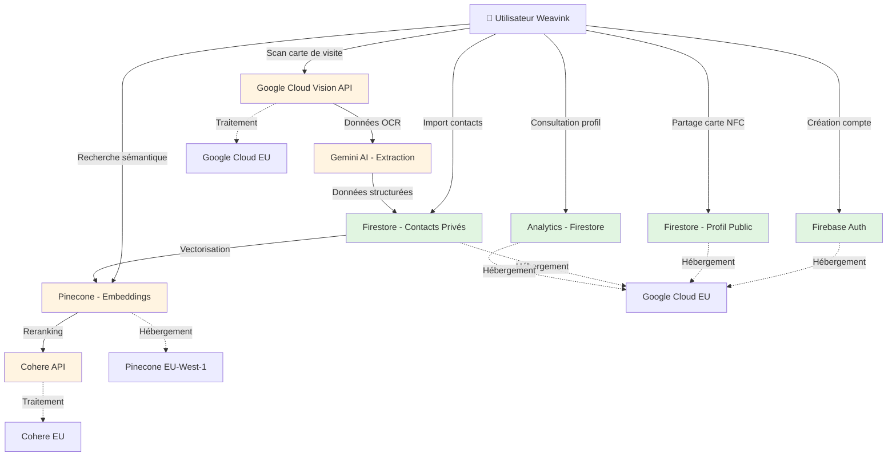

# Conformité RGPD - Weavink (Tapit SAS)
## Document Complémentaire - Dossier de Candidature Pépinière TARMAC

---

## Table des Matières

1. [Synthèse Exécutive](#1-synthèse-exécutive)
2. [Cadre Juridique RGPD en France](#2-cadre-juridique-rgpd-en-france)
3. [Cartographie des Données Personnelles](#3-cartographie-des-données-personnelles)
4. [Bases Légales du Traitement](#4-bases-légales-du-traitement)
5. [Droits des Utilisateurs](#5-droits-des-utilisateurs)
6. [Sous-Traitants et Transferts de Données](#6-sous-traitants-et-transferts-de-données)
7. [Mesures de Sécurité](#7-mesures-de-sécurité)
8. [Privacy by Design & by Default](#8-privacy-by-design--by-default)
9. [Conformité CNIL](#9-conformité-cnil)
10. [Plan d'Action et Roadmap](#10-plan-daction-et-roadmap)

---

## 1. Synthèse Exécutive

### 1.1. Contexte

**Weavink (Tapit SAS)** est une plateforme SaaS de gestion intelligente de réseau professionnel combinant :
- **Produit physique** : Cartes de visite NFC (PVC, bois, métal)
- **Plateforme numérique** : Application web/mobile de gestion de contacts avec IA

En tant qu'entreprise française traitant des **données personnelles de professionnels**, nous sommes soumis au **Règlement Général sur la Protection des Données (RGPD)** et à la **Loi Informatique et Libertés** modifiée.

### 1.2. Notre Engagement

**Nous nous engageons à une conformité RGPD totale** dès le lancement commercial, positionnant la protection des données comme un **avantage concurrentiel** et une **condition de confiance** indispensable pour nos clients B2B.

### 1.3. État Actuel de Conformité

```
┌─────────────────────────────────────────────────────────────┐
│          TABLEAU DE BORD CONFORMITÉ RGPD                    │
├─────────────────────────────────────────────────────────────┤
│                                                              │
│   ✅ ACQUIS                                                 │
│   ├─ Architecture sécurisée (7 couches de sécurité)        │
│   ├─ Hébergement Firebase EU (infrastructure Google Cloud)  │
│   ├─ Chiffrement at-rest et in-transit                     │
│   ├─ Journalisation des actions sensibles                   │
│   └─ Contrôle d'accès granulaire                           │
│                                                              │
│   🟡 EN COURS (Q4 2025)                                     │
│   ├─ Politique de confidentialité (draft en cours)         │
│   ├─ Registre des traitements (50% complété)               │
│   ├─ DPA avec sous-traitants (négociation)                 │
│   └─ Bandeau cookies (développement)                       │
│                                                              │
│   ⚠️  À IMPLÉMENTER (Q1 2026)                               │
│   ├─ Export de données utilisateur (portabilité)           │
│   ├─ Suppression en cascade (droit à l'oubli)              │
│   ├─ Centre de confidentialité complet                      │
│   ├─ Consentement granulaire pour IA                       │
│   └─ Nomination DPO ou DPO externe                         │
│                                                              │
│   📊 SCORE GLOBAL : 62/100                                  │
│   📈 OBJECTIF Q2 2026 : 95/100 (Conformité totale)         │
│                                                              │
└─────────────────────────────────────────────────────────────┘
```

### 1.4. Investissement Conformité

**Budget alloué sur 3 ans :**

| Année | Postes de dépenses | Montant |
|-------|-------------------|---------|
| **Année 1** | DPO externe, audit initial, legal counsel, assurance cyber-risque | **25 000 €** |
| **Année 2** | DPO interne 0.5 ETP, audits, DPA, formations | **60 000 €** |
| **Année 3** | DPO 1 ETP, certifications, audits annuels | **75 000 €** |
| **TOTAL** | | **160 000 €** |

---

## 2. Cadre Juridique RGPD en France

### 2.1. Textes Applicables

#### Règlement Européen
- **RGPD (Règlement UE 2016/679)** : Applicable depuis le 25 mai 2018
- **ePrivacy Directive (2002/58/CE)** : Spécifique aux communications électroniques et cookies

#### Droit Français
- **Loi Informatique et Libertés** (modifiée par Ordonnance n°2018-1125 du 12 décembre 2018)
- **Code pénal** : Articles sur les violations de données (art. 226-16 à 226-24)
- **Lignes directrices CNIL** spécifiques aux SaaS et aux technologies IA

### 2.2. Autorité de Contrôle

**CNIL (Commission Nationale de l'Informatique et des Libertés)**
- Siège : 3 Place de Fontenoy, 75007 Paris
- Pouvoirs : Contrôle, sanctions, conseils
- **Sanctions maximales** :
  - **20 millions d'euros** OU **4% du chiffre d'affaires annuel mondial**
  - La **plus élevée** des deux

### 2.3. Obligations Spécifiques aux Startups SaaS

```
┌──────────────────────────────────────────────────────────────┐
│        OBLIGATIONS RGPD POUR STARTUPS SAAS (CNIL)           │
├──────────────────────────────────────────────────────────────┤
│                                                               │
│  1️⃣  TRANSPARENCE                                            │
│     • Politique de confidentialité claire et accessible      │
│     • Information préalable à la collecte                    │
│     • Langue française obligatoire (+ anglais facultatif)    │
│                                                               │
│  2️⃣  CONSENTEMENT                                            │
│     • Consentement explicite pour cookies non-essentiels     │
│     • Opt-in obligatoire (pas de case pré-cochée)           │
│     • Retrait du consentement aussi facile que l'octroi      │
│                                                               │
│  3️⃣  REGISTRE DES TRAITEMENTS                                │
│     • Obligatoire pour toute entreprise                      │
│     • Mise à jour régulière                                  │
│     • Communicable à la CNIL sur demande                     │
│                                                               │
│  4️⃣  SÉCURITÉ                                                │
│     • Mesures techniques et organisationnelles appropriées   │
│     • Chiffrement des données sensibles                      │
│     • Pseudonymisation recommandée                           │
│                                                               │
│  5️⃣  NOTIFICATION DE VIOLATION                               │
│     • Notification CNIL sous 72h max                         │
│     • Notification utilisateurs si risque élevé              │
│     • Registre interne des violations                        │
│                                                               │
│  6️⃣  DPIP (si applicable)                                    │
│     • Analyse d'impact si traitement à risque élevé          │
│     • Consultation CNIL si risque résiduel élevé             │
│                                                               │
│  7️⃣  DPO (Data Protection Officer)                           │
│     • Recommandé pour SaaS B2B                               │
│     • Obligatoire si traitement à grande échelle             │
│     • Peut être externe (cabinet spécialisé)                 │
│                                                               │
└──────────────────────────────────────────────────────────────┘
```

### 2.4. Spécificités IA et Profilage

**EU AI Act (Règlement IA entré en vigueur août 2024)**

Notre utilisation de l'IA pour le groupement proactif et la recherche sémantique nous soumet à des obligations spécifiques :

| Fonctionnalité Weavink | Classification AI Act | Obligations |
|------------------------|----------------------|-------------|
| Recherche sémantique | **Risque minimal** | Transparence basique |
| Groupement proactif IA | **Risque limité** | Transparence + information utilisateur |
| Scoring de contacts (futur) | **Risque élevé** (si impact opportunités) | Audit, supervision humaine, certification |
| Recommandations contacts | **Risque limité** | Transparence |

**Notre approche :**
- ✅ **Human-in-the-loop** systématique : L'IA suggère, l'utilisateur valide
- ✅ **Transparence totale** : Explication de chaque décision IA
- ✅ **Opt-in explicite** pour les fonctionnalités IA avancées

---

## 3. Cartographie des Données Personnelles

### 3.1. Types de Données Collectées

#### A. Données d'Identité et de Contact (Utilisateur Weavink)

```
┌─────────────────────────────────────────────────────────┐
│  DONNÉES COLLECTÉES SUR L'UTILISATEUR WEAVINK          │
├─────────────────────────────────────────────────────────┤
│                                                          │
│  📋 Lors de la Création de Compte :                     │
│     • Nom, Prénom                                       │
│     • Adresse email (identifiant unique)                │
│     • Mot de passe (hashé bcrypt)                       │
│     • Numéro de téléphone (optionnel)                   │
│     • Entreprise / Titre professionnel                  │
│                                                          │
│  🎨 Profil Public (volontaire) :                        │
│     • Photo de profil                                   │
│     • Biographie                                        │
│     • Liens professionnels (LinkedIn, site web, etc.)   │
│     • Adresse postale (optionnelle)                     │
│                                                          │
│  💳 Données de Facturation (abonnés payants) :         │
│     • Informations de paiement (via Stripe)             │
│     • Adresse de facturation                            │
│     • Numéro SIRET (clients B2B)                        │
│                                                          │
└─────────────────────────────────────────────────────────┘
```

#### B. Données de Contacts Stockés (Tiers)

**Point critique RGPD** : Lorsqu'un utilisateur A stocke les coordonnées d'un contact B dans Weavink, nous devenons responsables du traitement des données de B.

```
┌─────────────────────────────────────────────────────────┐
│  DONNÉES SUR LES CONTACTS STOCKÉS                       │
├─────────────────────────────────────────────────────────┤
│                                                          │
│  📇 Informations de Contact :                           │
│     • Nom, Prénom                                       │
│     • Email, Téléphone                                  │
│     • Entreprise, Poste                                 │
│     • Adresse (optionnelle)                             │
│     • Réseaux sociaux (optionnels)                      │
│                                                          │
│  📝 Métadonnées Enrichies :                             │
│     • Date de rencontre                                 │
│     • Lieu de rencontre (événement, salon)              │
│     • Notes privées de l'utilisateur                    │
│     • Tags et catégories                                │
│     • Groupes d'appartenance                            │
│                                                          │
│  🖼️ Données issues du scan carte de visite :           │
│     • Image de la carte (stockée temporairement)        │
│     • Données extraites par OCR + IA                    │
│                                                          │
└─────────────────────────────────────────────────────────┘
```

#### C. Données de Comportement et d'Usage

```
┌─────────────────────────────────────────────────────────┐
│  DONNÉES D'ANALYTICS ET DE COMPORTEMENT                 │
├─────────────────────────────────────────────────────────┤
│                                                          │
│  📊 Analytics Profil :                                  │
│     • Nombre de vues du profil                          │
│     • Origine géographique des visiteurs (pays/ville)   │
│     • Appareils utilisés (desktop/mobile/tablette)      │
│     • Referrers (source du trafic)                      │
│     • Clics sur les liens du profil                     │
│                                                          │
│  🔍 Utilisation de la Plateforme :                      │
│     • Requêtes de recherche sémantique                  │
│     • Groupes créés (manuels et IA)                     │
│     • Fréquence d'utilisation                           │
│     • Fonctionnalités utilisées                         │
│                                                          │
│  🍪 Cookies et Traceurs :                               │
│     • Cookie de session (essentiel)                     │
│     • Cookies analytics (consentement requis)           │
│     • Préférences utilisateur                           │
│                                                          │
│  🔒 Logs de Sécurité :                                  │
│     • Tentatives de connexion                           │
│     • Adresses IP                                       │
│     • Actions sensibles (changement mdp, export data)   │
│                                                          │
└─────────────────────────────────────────────────────────┘
```

### 3.2. Flux de Données



**Légende :**
- 🟢 **Vert** : Stockage EU garanti
- 🟡 **Jaune** : Traitement temporaire, vérification DPA requise

### 3.3. Durées de Conservation

| Type de Données | Durée de Conservation | Base Légale | Suppression |
|-----------------|----------------------|-------------|-------------|
| **Compte utilisateur actif** | Tant que le compte est actif | Exécution du contrat | Suppression à la demande |
| **Compte inactif** | 24 mois après dernière connexion | Intérêt légitime | Suppression automatique + notification 30j avant |
| **Contacts stockés** | Tant que l'utilisateur conserve | Exécution du contrat | Suppression par l'utilisateur OU exercice droit à l'oubli du contact |
| **Analytics agrégées** | 26 mois (conforme CNIL) | Intérêt légitime | Anonymisation après 26 mois |
| **Logs de sécurité** | 12 mois | Obligation légale | Suppression automatique |
| **Données de facturation** | 10 ans (obligation fiscale) | Obligation légale | Archivage intermédiaire puis suppression |
| **Images cartes de visite** | 48h après extraction | Intérêt légitime | Suppression automatique |

---

## 4. Bases Légales du Traitement

### 4.1. Tableau des Finalités et Bases Légales

| Finalité | Données Traitées | Base Légale RGPD | Intérêt | Opt-out possible ? |
|----------|------------------|------------------|---------|-------------------|
| **Création et gestion du compte** | Email, mot de passe, nom | Art. 6.1.b - Exécution du contrat | Fournir le service | ❌ Non (nécessaire au service) |
| **Affichage du profil public** | Nom, photo, bio, liens | Art. 6.1.a - Consentement | Partage d'informations pro | ✅ Oui (profil désactivable) |
| **Stockage des contacts** | Données de contacts tiers | Art. 6.1.b - Exécution du contrat | Carnet d'adresses centralisé | ❌ Non (cœur du service) |
| **Recherche sémantique IA** | Contacts + embeddings vectoriels | Art. 6.1.a - Consentement (Premium) | Intelligence relationnelle | ✅ Oui (feature Premium opt-in) |
| **Groupement proactif IA** | Contacts + métadonnées | Art. 6.1.a - Consentement (Premium) | Révélation de clusters cachés | ✅ Oui (feature Premium opt-in) |
| **Analytics de profil** | Vues, clics, géolocalisation | Art. 6.1.f - Intérêt légitime | Amélioration du service, ROI utilisateur | ✅ Oui (désactivable) |
| **Scan carte de visite (OCR + IA)** | Image carte + données extraites | Art. 6.1.a - Consentement | Gain de temps utilisateur | ✅ Oui (fonctionnalité activée manuellement) |
| **Facturation et paiement** | CB, adresse, SIRET | Art. 6.1.b - Exécution du contrat | Encaissement abonnements | ❌ Non (obligatoire pour payants) |
| **Sécurité et prévention fraude** | IP, logs connexions | Art. 6.1.f - Intérêt légitime | Protection des utilisateurs | ❌ Non (sécurité) |
| **Support client** | Email, messages échangés | Art. 6.1.b - Exécution du contrat | Assistance technique | ❌ Non (lié au service) |
| **Marketing (newsletter)** | Email | Art. 6.1.a - Consentement | Communication produit | ✅ Oui (opt-in explicite) |

### 4.2. Gestion des Consentements

**Principe** : Le consentement doit être **libre, spécifique, éclairé et univoque** (RGPD Art. 4.11).

#### Consentements Collectés

```
┌──────────────────────────────────────────────────────────┐
│          GESTION DES CONSENTEMENTS WEAVINK              │
├──────────────────────────────────────────────────────────┤
│                                                           │
│  ✅ À la Création de Compte :                            │
│     ☐ J'accepte les Conditions Générales d'Utilisation  │
│     ☐ J'accepte la Politique de Confidentialité         │
│     ☐ J'accepte de recevoir des emails marketing        │
│        (case NON pré-cochée, opt-in volontaire)         │
│                                                           │
│  ✅ Lors de l'Utilisation des Features IA :              │
│     ☐ J'accepte que mes contacts soient analysés par    │
│        l'IA pour la recherche sémantique                 │
│     ☐ J'accepte le groupement automatique par IA de     │
│        mes contacts                                      │
│                                                           │
│  ✅ Cookies et Traceurs (bandeau obligatoire) :          │
│     ☐ Cookies strictement nécessaires (pré-activés)     │
│     ☐ Cookies de mesure d'audience                      │
│     ☐ Cookies de personnalisation                       │
│                                                           │
│  🔄 Retrait du Consentement :                            │
│     • Accessible à tout moment depuis "Paramètres"       │
│     • Aussi facile à retirer qu'à donner                │
│     • Effet immédiat (arrêt du traitement)              │
│                                                           │
└──────────────────────────────────────────────────────────┘
```

#### Traçabilité des Consentements

Nous conservons la preuve de chaque consentement :

```javascript
// Collection Firestore: ConsentLogs
{
  userId: "abc123",
  timestamp: "2025-10-30T14:23:00Z",
  consentType: "ai_semantic_search",
  action: "granted", // ou "withdrawn"
  ipAddress: "192.168.1.1",
  userAgent: "Mozilla/5.0...",
  consentText: "J'accepte que mes contacts soient analysés..."
}
```

---

## 5. Droits des Utilisateurs

### 5.1. Les 8 Droits Fondamentaux RGPD

```
┌────────────────────────────────────────────────────────────┐
│         LES 8 DROITS DES PERSONNES (RGPD)                 │
├────────────────────────────────────────────────────────────┤
│                                                             │
│  1️⃣  DROIT D'ACCÈS (Art. 15)                               │
│     "Quelles données avez-vous sur moi ?"                  │
│                                                             │
│  2️⃣  DROIT DE RECTIFICATION (Art. 16)                      │
│     "Corrigez mes informations incorrectes"                │
│                                                             │
│  3️⃣  DROIT À L'EFFACEMENT / "Droit à l'oubli" (Art. 17)   │
│     "Supprimez toutes mes données"                         │
│                                                             │
│  4️⃣  DROIT À LA LIMITATION DU TRAITEMENT (Art. 18)         │
│     "Gelez mes données (ne les traitez plus)"             │
│                                                             │
│  5️⃣  DROIT À LA PORTABILITÉ (Art. 20)                      │
│     "Donnez-moi mes données en format exploitable"         │
│                                                             │
│  6️⃣  DROIT D'OPPOSITION (Art. 21)                          │
│     "Je m'oppose au traitement de mes données"            │
│                                                             │
│  7️⃣  DROIT DE NE PAS FAIRE L'OBJET D'UNE DÉCISION          │
│     AUTOMATISÉE (Art. 22)                                  │
│     "Je refuse les décisions 100% automatiques"            │
│                                                             │
│  8️⃣  DROIT DE DÉFINIR DES DIRECTIVES POST-MORTEM (Art. 85 LIL) │
│     "Que deviennent mes données après mon décès ?"        │
│                                                             │
└────────────────────────────────────────────────────────────┘
```

### 5.2. Implémentation Technique des Droits

#### ✅ Droits Déjà Implémentés

**1. Droit d'Accès Partiel**
- L'utilisateur peut consulter ses données de profil
- Tableau de bord avec statistiques d'utilisation
- ⚠️ **Manque** : Export complet JSON de toutes les données

**2. Droit de Rectification**
- Modification du profil en temps réel
- Édition/suppression de contacts individuels
- Modification des informations de facturation

**3. Droit de Suppression Partiel**
- L'utilisateur peut supprimer son compte
- ⚠️ **Manque** : Suppression en cascade dans tous les carnets d'adresses si contact partagé

#### ⚠️ Droits À Implémenter (Priorité Haute)

**1. Droit d'Accès Complet - "Télécharger mes données"**

```
Fonctionnalité à développer : Centre de Confidentialité
─────────────────────────────────────────────────────

📥 Bouton "Télécharger toutes mes données"

Génère un fichier ZIP contenant :
  ├─ mon_profil.json (données de compte)
  ├─ mes_contacts.csv (tous les contacts)
  ├─ mes_analytics.json (statistiques de profil)
  ├─ mes_consentements.json (historique consentements)
  ├─ mes_notes.txt (notes sur contacts)
  └─ readme.txt (explication des fichiers)

Délai de génération : < 24h
Format : JSON + CSV (standards interopérables)
Conformité : RGPD Art. 20 (portabilité)
```

**2. Droit à l'Effacement Complet - "Supprimer mon compte ET mes traces"**

```
Fonctionnalité à développer : Suppression en Cascade
─────────────────────────────────────────────────────

Scénario :
  User A supprime son compte
  → Son profil public est supprimé
  → MAIS il existe dans les carnets de User B, C, D...

Solution RGPD :
  1. Suppression du compte et données de A
  2. Notification aux users B, C, D :
     "Le contact [Nom A] a demandé la suppression de ses
      données. Souhaitez-vous conserver ce contact ?"

     ☐ Oui, conserver (base légale : intérêt légitime + notes personnelles)
     ☐ Non, supprimer de mon carnet

  3. Si aucune réponse sous 30 jours :
     → Anonymisation du contact dans carnets B, C, D
     → Remplacement par "Contact supprimé - [Date]"

Technique :
  - Firebase Cloud Function déclenchée sur deleteUser
  - Recherche dans toute la collection Contacts
  - Envoi notifications in-app + email
  - Anonymisation automatique après délai
```

**3. Droit à la Portabilité - Export Standard**

```
Format de Portabilité Standardisé
──────────────────────────────────

Contacts exportés au format vCard (.vcf) :
  ✅ Compatible avec Google Contacts
  ✅ Compatible avec Apple Contacts
  ✅ Compatible avec Outlook
  ✅ Compatible avec tous les CRM

Exemple :
BEGIN:VCARD
VERSION:3.0
FN:Jean Dupont
ORG:Entreprise SAS
TITLE:Directeur Commercial
TEL:+33612345678
EMAIL:jean.dupont@example.com
NOTE:Rencontré salon XYZ le 15/03/2025
END:VCARD

Permet à l'utilisateur de migrer vers un concurrent
sans perte de données → Conformité RGPD Art. 20
```

**4. Droit d'Opposition - Opt-out Granulaire**

```
Centre de Confidentialité - Gestion Fine
─────────────────────────────────────────

Paramètres de Vie Privée :

  Traitement de mes données :
    ☐ Recherche sémantique IA          [Activé]  [Désactiver]
    ☐ Groupement automatique IA        [Activé]  [Désactiver]
    ☐ Analytics de mon profil          [Activé]  [Désactiver]
    ☐ Recommandations de contacts      [Désactivé] [Activer]

  Partage de données :
    ☐ Mon profil est visible publiquement  [Activé]  [Désactiver]
    ☐ Indexation moteurs de recherche      [Activé]  [Désactiver]

  Communications :
    ☐ Emails marketing produit         [Désactivé] [Activer]
    ☐ Notifications in-app             [Activé]  [Désactiver]

Effet : Immédiat (arrêt du traitement dans l'heure)
```

### 5.3. Procédure de Traitement des Demandes

**Délai légal RGPD** : **1 mois** maximum (extensible à 3 mois si complexe, avec justification)

**Notre objectif** : **15 jours** maximum

```
┌────────────────────────────────────────────────────────┐
│    WORKFLOW TRAITEMENT DEMANDES RGPD                   │
├────────────────────────────────────────────────────────┤
│                                                         │
│  J0 : Réception de la demande                          │
│       ↓                                                 │
│       • Via formulaire web "Exercer mes droits"        │
│       • Ou via email : privacy@weavink.io              │
│       • Ticket créé automatiquement                    │
│                                                         │
│  J1 : Vérification de l'identité                       │
│       ↓                                                 │
│       • Email de confirmation envoyé                   │
│       • Demande de pièce d'identité si doute           │
│       ⚠️  Sécurité : Éviter usurpation d'identité     │
│                                                         │
│  J2-J10 : Traitement de la demande                     │
│       ↓                                                 │
│       • Export des données (si accès/portabilité)      │
│       • Suppression (si effacement)                    │
│       • Rectification (si correction)                  │
│       • Validation par DPO                             │
│                                                         │
│  J11-J15 : Réponse à l'utilisateur                     │
│       ↓                                                 │
│       • Email avec pièce jointe (export)               │
│       • Confirmation de suppression                    │
│       • Ou refus motivé (si demande non fondée)        │
│                                                         │
│  📊 KPI : 95% des demandes traitées sous 15 jours      │
│                                                         │
└────────────────────────────────────────────────────────┘
```

**Cas de refus légitime** (RGPD Art. 17.3) :
- Données nécessaires à la défense en justice
- Obligation légale de conservation (factures : 10 ans)
- Exercice de la liberté d'expression (rare pour nous)

---

## 6. Sous-Traitants et Transferts de Données

### 6.1. Liste des Sous-Traitants (Processors)

| Sous-Traitant | Service | Localisation Serveurs | Données Traitées | DPA Signé | Clause Transfert |
|---------------|---------|----------------------|------------------|-----------|------------------|
| **Google Cloud (Firebase)** | Backend, Auth, Database | EU-West-1 (Belgique) | Toutes données utilisateurs | ✅ Oui (Standard Google) | ✅ SCCs EU |
| **Pinecone** | Base vectorielle | EU-West-1 (Irlande) | Embeddings contacts (pseudonymisés) | 🟡 En cours | ✅ SCCs EU |
| **Cohere** | Reranking IA | EU (Francfort) | Requêtes search + résultats | 🟡 En cours | ✅ SCCs EU |
| **Google Cloud Vision** | OCR cartes de visite | EU-West-1 (Belgique) | Images cartes (temp. 48h) | ✅ Oui (Standard Google) | ✅ SCCs EU |
| **Google Gemini** | Extraction données IA | EU (Belgique) | Texte OCR, métadonnées | ✅ Oui (Standard Google) | ✅ SCCs EU |
| **Vercel** | Hébergement frontend | EU-West-1 (Irlande) | Métadonnées HTTP, logs | ✅ Oui | ✅ SCCs EU |
| **Stripe** | Paiements | EU (Irlande) | Données bancaires, facturation | ✅ Oui (Standard Stripe) | ✅ SCCs EU |
| **Number** | Comptabilité | France | Factures, données fiscales | ⚠️ À faire | N/A (France) |

**Légende :**
- ✅ **Conforme** : DPA signé + serveurs EU
- 🟡 **En cours** : Négociation DPA en cours (deadline : Décembre 2025)
- ⚠️ **Action requise** : DPA à signer avant lancement commercial

### 6.2. Data Processing Agreements (DPA)

**Obligation RGPD Art. 28** : Tout sous-traitant doit signer un **contrat de sous-traitance** (DPA) spécifiant :
- Nature et finalité du traitement
- Type de données et catégories de personnes concernées
- Obligations et droits du responsable de traitement (Weavink)
- Mesures de sécurité du sous-traitant
- Assistance pour répondre aux demandes RGPD
- Notification de violations de données (72h)
- Sort des données en fin de contrat (restitution ou suppression)

**Modèle type** : [DPA CNIL](https://www.cnil.fr/fr/modele-de-clauses-rgpd-entre-responsables-de-traitement-et-sous-traitants)

### 6.3. Transferts Hors-UE

**Principe RGPD** : Les transferts de données personnelles hors UE/EEE sont **interdits** sauf garanties appropriées.

**Notre situation** :

```
┌────────────────────────────────────────────────────────┐
│       ANALYSE TRANSFERTS INTERNATIONAUX               │
├────────────────────────────────────────────────────────┤
│                                                         │
│  ✅ PAS DE TRANSFERT HORS-UE ACTUELLEMENT              │
│                                                         │
│     • Firebase : Région EU-WEST-1 (Belgique)           │
│     • Pinecone : EU-WEST-1 (Irlande)                   │
│     • Cohere : EU (Francfort)                          │
│     • Vercel : EU-WEST-1 (Irlande)                     │
│     • Stripe : EU (Irlande)                            │
│                                                         │
│  ⚠️  RISQUES POTENTIELS :                              │
│                                                         │
│     1. Cloud Act (USA) :                               │
│        Google, Stripe, Vercel sont des sociétés US    │
│        → Risque d'accès par autorités US              │
│        → Mitigation : Chiffrement E2E des données      │
│                       sensibles                        │
│                                                         │
│     2. Expansion future :                              │
│        Si clients US/Canada → Besoin SCCs ou DPF      │
│                                                         │
│  📋 MÉCANISMES DE PROTECTION PRÉVUS :                  │
│                                                         │
│     • Standard Contractual Clauses (SCCs) EU           │
│     • Chiffrement at-rest et in-transit                │
│     • Pseudonymisation des données sensibles           │
│     • Monitoring des accès (audit logs)                │
│                                                         │
└────────────────────────────────────────────────────────┘
```

**Si expansion USA/monde** :
- ✅ Utiliser le **Data Privacy Framework (DPF)** UE-USA (remplace Privacy Shield invalidé)
- ✅ Signer des **SCCs (Standard Contractual Clauses)** avec chaque sous-traitant
- ✅ Réaliser un **Transfer Impact Assessment (TIA)** pour évaluer les risques

---

## 7. Mesures de Sécurité

### 7.1. Architecture de Sécurité Multi-Couches

Weavink implémente une **défense en profondeur** (7 couches) inspirée des standards enterprise :

```
┌─────────────────────────────────────────────────────────┐
│          7-LAYER SECURITY ARCHITECTURE                 │
├─────────────────────────────────────────────────────────┤
│                                                          │
│  🔒 LAYER 1 : Client-Side UI Check                     │
│     • Masquage des features selon rôle                  │
│     • Prévention des erreurs utilisateur                │
│                                                          │
│  🔒 LAYER 2 : Component Guard (React)                  │
│     • AdminProtection wrapper                           │
│     • Vérification côté frontend                        │
│                                                          │
│  🔒 LAYER 3 : API Call Authentication                  │
│     • JWT Token dans headers                            │
│     • Expiration 1h (refresh token 7j)                  │
│                                                          │
│  🔒 LAYER 4 : Rate Limiting                            │
│     • 100 req/min par IP (standard)                     │
│     • 500 req/min pour Business+                        │
│     • Protection DDoS                                   │
│                                                          │
│  🔒 LAYER 5 : Firebase Authentication                  │
│     • Vérification JWT côté serveur                     │
│     • MFA optionnel (2FA)                               │
│                                                          │
│  🔒 LAYER 6 : Permission Check                         │
│     • Vérification rôle (user, admin, view-only)       │
│     • Feature flags (IA = Premium+)                     │
│                                                          │
│  🔒 LAYER 7 : Business Logic Execution                 │
│     • Opérations sensibles serveur-side only            │
│     • Validation finale des données                     │
│                                                          │
└─────────────────────────────────────────────────────────┘
```

### 7.2. Mesures Techniques

#### A. Chiffrement

| Type de Données | Chiffrement au Repos | Chiffrement en Transit | Standard |
|-----------------|---------------------|------------------------|----------|
| **Mot de passe** | Hashage bcrypt (10 rounds) | HTTPS TLS 1.3 | ✅ Industry standard |
| **Données Firestore** | AES-256 (Google Cloud) | HTTPS TLS 1.3 | ✅ Automatic |
| **Notes privées** | AES-256 client-side (prévu) | HTTPS TLS 1.3 | 🟡 Q1 2026 |
| **Images cartes** | AES-256 (Google Cloud Storage) | HTTPS TLS 1.3 | ✅ Automatic |
| **Paiements** | Tokenisation Stripe | HTTPS TLS 1.3 + PCI-DSS | ✅ Stripe compliant |

#### B. Authentification et Contrôle d'Accès

```
┌───────────────────────────────────────────────────────┐
│        AUTHENTICATION & ACCESS CONTROL               │
├───────────────────────────────────────────────────────┤
│                                                        │
│  🔐 Authentification                                  │
│     • Firebase Auth (OAuth 2.0 + JWT)                 │
│     • Support Google, LinkedIn, Email/Password        │
│     • MFA (2FA) via authenticator app (recommandé)    │
│     • Politique mots de passe :                       │
│       - Min 12 caractères                             │
│       - Majuscule + minuscule + chiffre + symbole     │
│       - Vérification contre base Have I Been Pwned    │
│                                                        │
│  👥 Rôles et Permissions                              │
│     • User : Accès standard (profil + contacts)       │
│     • Admin : Gestion équipe (Business+)              │
│     • View-Only Admin : Lecture seule (audit)         │
│     • Super Admin : Toutes permissions (fondateurs)   │
│                                                        │
│  🔍 Audit Logs                                        │
│     • Toute action sensible loggée :                  │
│       - Connexions (IP, timestamp, user-agent)        │
│       - Changement mot de passe                       │
│       - Export de données                             │
│       - Suppression compte                            │
│       - Modification permissions (admin)              │
│     • Logs conservés 12 mois (RGPD Art. 5.1.e)       │
│     • Accessible aux audits CNIL                      │
│                                                        │
└───────────────────────────────────────────────────────┘
```

#### C. Protection contre les Attaques

| Menace | Protection | Implémentation |
|--------|-----------|----------------|
| **Injection SQL** | N/A (Firestore NoSQL) | ✅ Pas de SQL |
| **XSS (Cross-Site Scripting)** | Sanitisation inputs | ✅ React auto-escape + DOMPurify |
| **CSRF (Cross-Site Request Forgery)** | Token CSRF | ✅ Firebase SDK |
| **Brute Force Login** | Rate limiting + CAPTCHA | ✅ 5 tentatives max → CAPTCHA |
| **DDoS** | Cloudflare + Rate limiting | 🟡 Cloudflare à activer (Q1 2026) |
| **Session Hijacking** | HttpOnly cookies + SameSite | ✅ Firebase defaults |
| **Man-in-the-Middle** | HTTPS obligatoire (HSTS) | ✅ Vercel auto-config |

#### D. Gestion des Vulnérabilités

```
Procédure de Sécurité Continue
───────────────────────────────

📅 Automatisé :
  • Dépendances npm auditées (npm audit) : Hebdomadaire
  • Scans Dependabot GitHub : Quotidien
  • Mises à jour sécurité Firebase : Auto-appliquées

📅 Manuel :
  • Code review sécurité : Chaque Pull Request
  • Penetration testing : Annuel (cabinet externe)
  • Audit RGPD complet : Annuel

🚨 Incident Response :
  • Détection → Notification équipe sous 1h
  • Évaluation risque → Sous 4h
  • Mitigation → Sous 24h
  • Notification CNIL si breach → Sous 72h (RGPD Art. 33)
  • Notification users si risque élevé → Sous 72h (RGPD Art. 34)
```

### 7.3. Mesures Organisationnelles

#### A. Sensibilisation et Formation

| Public | Formation | Fréquence | Contenu |
|--------|-----------|-----------|---------|
| **Fondateurs** | RGPD avancé | Annuelle | Obligations légales, DPO, incidents |
| **Développeurs** | Secure coding + RGPD | Onboarding + annuelle | OWASP Top 10, Privacy by Design |
| **Support client** | RGPD utilisateurs | Onboarding + semestrielle | Droits des personnes, traitement demandes |
| **Futurs commerciaux** | Conformité B2B | Onboarding | Arguments RGPD, audits clients |

#### B. Documentation et Procédures

```
📚 Documentation RGPD Obligatoire
──────────────────────────────────

✅ Déjà créés :
  • Architecture technique (ce repo GitHub)
  • Guides d'implémentation (ADMIN_SECURITY_*.md)

🟡 En cours (Q4 2025) :
  • Registre des traitements (modèle CNIL)
  • Politique de confidentialité (FR + EN)
  • Procédure de gestion des violations de données
  • Charte de sécurité informatique

⚠️  À créer (Q1 2026) :
  • Analyse d'impact (DPIA) pour le groupement IA
  • Procédure d'exercice des droits
  • Plan de continuité d'activité (PCA)
  • Contrats de sous-traitance (DPA) finalisés
```

---

## 8. Privacy by Design & by Default

**Principe RGPD Art. 25** : La protection des données doit être intégrée **dès la conception** du produit et les paramètres par défaut doivent être **les plus protecteurs**.

### 8.1. Privacy by Design - Mesures Techniques

```
┌──────────────────────────────────────────────────────────┐
│         PRIVACY BY DESIGN - WEAVINK                      │
├──────────────────────────────────────────────────────────┤
│                                                           │
│  1️⃣  MINIMISATION DES DONNÉES                            │
│     • Seules les données strictement nécessaires         │
│     • Champs optionnels clairement marqués               │
│     • Pas de collecte "au cas où"                        │
│                                                           │
│     Exemple : L'adresse postale est optionnelle          │
│               (non requise pour le service)              │
│                                                           │
│  2️⃣  PSEUDONYMISATION                                    │
│     • Embeddings vectoriels = hash des données           │
│     • User IDs opaques (UUIDs, pas d'emails)            │
│     • Séparation données d'identification / métadonnées  │
│                                                           │
│     Exemple : Pinecone ne voit que des vecteurs de       │
│               nombres, pas de noms/emails                │
│                                                           │
│  3️⃣  CHIFFREMENT PAR DÉFAUT                              │
│     • HTTPS obligatoire (HSTS)                           │
│     • Firestore chiffré at-rest automatiquement          │
│     • Future : Notes privées chiffrées client-side       │
│                                                           │
│  4️⃣  LIMITATION DES ACCÈS (Least Privilege)              │
│     • Chaque service accède au minimum                   │
│     • Firestore Rules granulaires                        │
│     • Logs d'accès pour audit                            │
│                                                           │
│  5️⃣  DURÉE DE CONSERVATION LIMITÉE                       │
│     • Suppression auto comptes inactifs (24 mois)        │
│     • Analytics anonymisées après 26 mois                │
│     • Images cartes supprimées après 48h                 │
│                                                           │
│  6️⃣  TRANSPARENCE ALGORITHMIQUE (IA)                     │
│     • Chaque suggestion IA = explication                 │
│     • Score de confiance affiché                         │
│     • Utilisateur peut valider/rejeter                   │
│                                                           │
│  7️⃣  PORTABILITÉ NATIVE                                  │
│     • Export vCard standard                              │
│     • Format JSON lisible humain                         │
│     • Pas de lock-in propriétaire                        │
│                                                           │
└──────────────────────────────────────────────────────────┘
```

### 8.2. Privacy by Default - Paramètres par Défaut

```
RÉGLAGES PAR DÉFAUT À LA CRÉATION DE COMPTE
────────────────────────────────────────────

✅ MAXIMUM DE PROTECTION :

  Visibilité du profil :
    ☑ Profil privé (non indexé moteurs de recherche)
    ☐ Profil public

  Fonctionnalités IA :
    ☐ Recherche sémantique activée
    ☐ Groupement automatique activé
    → Nécessite opt-in explicite (upgrade Premium)

  Analytics :
    ☑ Analytics de base (nombre de vues)
    ☐ Analytics détaillées (géolocalisation, appareils)

  Partage de données :
    ☐ Partager mes statistiques avec l'équipe
    ☐ Apparaître dans les suggestions de contacts

  Communications :
    ☐ Recevoir des emails marketing
    ☑ Notifications importantes uniquement

📌 L'utilisateur doit ACTIVEMENT choisir de partager plus
   → Pas de cases pré-cochées (interdit RGPD)
```

---

## 9. Conformité CNIL

### 9.1. Registre des Traitements

**Obligation RGPD Art. 30** : Toute organisation doit tenir un **registre des activités de traitement**.

**Modèle simplifié** (extrait) :

| N° | Finalité | Base Légale | Catégories de Données | Destinataires | Durée | Transfert Hors-UE |
|----|----------|-------------|----------------------|---------------|-------|-------------------|
| 1 | Gestion des comptes utilisateurs | Contrat | Identité, contact, profil | Weavink, Firebase | Vie du compte + 24 mois inactivité | Non |
| 2 | Stockage des contacts professionnels | Contrat | Identité, contact tiers, notes | Weavink, Firebase | Choix utilisateur | Non |
| 3 | Recherche sémantique IA | Consentement | Contacts, embeddings | Weavink, Pinecone, Cohere | Vie du compte | Non (EU) |
| 4 | Analytics de profil | Intérêt légitime | Vues, clics, géoloc, appareils | Weavink, Firebase | 26 mois | Non |
| 5 | Scan cartes de visite | Consentement | Image carte, OCR | Weavink, Google Vision, Gemini | 48h (image), vie du compte (données) | Non (EU) |
| 6 | Facturation | Contrat | Bancaire, adresse, SIRET | Weavink, Stripe, Number | 10 ans (fiscal) | Non (EU) |
| 7 | Sécurité et logs | Obligation légale | IP, logs connexion | Weavink, Firebase | 12 mois | Non |
| 8 | Support client | Contrat | Email, messages | Weavink, Crisp (futur) | 3 ans | Non |

**Format complet** : Document Excel disponible sur demande (40+ lignes détaillées)

### 9.2. Analyse d'Impact (DPIA)

**Quand est-elle obligatoire ?** (RGPD Art. 35)

Lorsque le traitement est **susceptible d'engendrer un risque élevé** :
- ✅ Profilage automatisé à grande échelle
- ✅ Traitement à grande échelle de données sensibles
- ✅ Surveillance systématique

**Weavink est-il concerné ?**

```
┌──────────────────────────────────────────────────────┐
│     ÉVALUATION BESOIN DPIA (Data Protection         │
│          Impact Assessment)                          │
├──────────────────────────────────────────────────────┤
│                                                       │
│  🟢 PAS DE DPIA REQUISE pour :                       │
│     • Stockage contacts (traitement standard)        │
│     • Analytics profil (non invasif)                 │
│     • Scan cartes de visite (consentement)           │
│                                                       │
│  🟡 DPIA RECOMMANDÉE pour :                          │
│     • Groupement proactif par IA                     │
│       Raison : Profilage automatisé des contacts     │
│                                                       │
│  🔴 DPIA OBLIGATOIRE si future feature :             │
│     • Scoring prédictif de contacts                  │
│     • Recommandations impactant opportunités         │
│                                                       │
│  📋 NOTRE PLAN :                                     │
│     • DPIA "Groupement IA" : Q1 2026                 │
│     • Validation par DPO externe                     │
│     • Publication résumé (transparence)              │
│                                                       │
└──────────────────────────────────────────────────────┘
```

**Processus DPIA** (si déclenchée) :

1. **Description du traitement** : Finalité, données, destinataires
2. **Nécessité et proportionnalité** : Justification du besoin
3. **Évaluation des risques** : Impact sur droits/libertés
4. **Mesures de protection** : Techniques + organisationnelles
5. **Validation** : Par le DPO ou consultation CNIL si risque résiduel élevé

### 9.3. DPO (Délégué à la Protection des Données)

**Obligation ou Recommandation ?**

```
DPO OBLIGATOIRE si (RGPD Art. 37) :
  ☐ Autorité publique (Non, nous sommes une SaaS privée)
  ☐ Surveillance systématique à grande échelle
     → Weavink : Non, analytics opt-in et limité
  ☐ Traitement à grande échelle de données sensibles
     → Weavink : Non, données professionnelles (non sensibles Art. 9)

DPO RECOMMANDÉ si :
  ☑ SaaS B2B avec engagement de conformité
  ☑ Utilisation d'IA pour traitement automatisé
  ☑ Argument commercial (rassurer clients entreprise)

NOTRE DÉCISION :
  • Année 1 : DPO EXTERNE (cabinet spécialisé) - 12 k€/an
  • Année 2-3 : DPO INTERNE 0.5 ETP (mutualisé avec legal/compliance)
  • Année 3+ : DPO INTERNE 1 ETP dédié
```

**Missions du DPO** :
- ✅ Conseiller l'organisation sur la conformité
- ✅ Contrôler le respect du RGPD
- ✅ Point de contact avec la CNIL
- ✅ Sensibiliser et former les équipes
- ✅ Coopérer avec l'autorité de contrôle
- ✅ Gérer les demandes d'exercice des droits

**Contact DPO prévu** : dpo@weavink.io (actif Q1 2026)

### 9.4. Violations de Données (Data Breaches)

**Procédure RGPD Art. 33 & 34** :

```
┌────────────────────────────────────────────────────────┐
│       PLAN DE RÉPONSE AUX INCIDENTS (PRI)             │
├────────────────────────────────────────────────────────┤
│                                                         │
│  🚨 DÉTECTION                                          │
│     • Monitoring automatique (Firebase, Sentry)        │
│     • Alertes anomalies (taux d'erreur, accès)         │
│     • Signalement utilisateur ou interne               │
│                                                         │
│  📋 H+1 : ÉVALUATION INITIALE                          │
│     Questions :                                        │
│     1. Y a-t-il eu violation de données ?              │
│     2. Quelles données sont concernées ?               │
│     3. Combien d'utilisateurs impactés ?               │
│     4. Quel est le risque pour les personnes ?         │
│        (Faible / Modéré / Élevé / Très élevé)         │
│                                                         │
│  🔒 H+4 : CONTAINMENT (Confinement)                    │
│     • Isolation du système compromis                   │
│     • Blocage de l'attaque en cours                    │
│     • Sauvegarde des logs (forensic)                   │
│                                                         │
│  📢 H+72 MAX : NOTIFICATION CNIL                       │
│     Si risque pour droits/libertés des personnes :     │
│     • Formulaire en ligne CNIL                         │
│     • Description de la violation                      │
│     • Catégories et nombre de personnes               │
│     • Mesures prises et envisagées                     │
│                                                         │
│  📧 H+72 MAX : NOTIFICATION UTILISATEURS               │
│     Si risque ÉLEVÉ pour les personnes :               │
│     • Email à tous les utilisateurs impactés           │
│     • Communication claire et transparente             │
│     • Mesures de protection recommandées               │
│       (ex: changement mot de passe)                    │
│                                                         │
│  🔍 J+7 : POST-MORTEM                                  │
│     • Analyse cause racine                             │
│     • Amélioration sécurité                            │
│     • Documentation incident                           │
│     • Formation équipe si nécessaire                   │
│                                                         │
│  📊 REGISTRE DES VIOLATIONS                            │
│     • Conservation 5 ans                               │
│     • Accessible à la CNIL sur demande                 │
│                                                         │
└────────────────────────────────────────────────────────┘
```

**Exemples de violations nécessitant notification** :
- ✅ Accès non autorisé à la base de données contacts
- ✅ Fuite de mots de passe (même hashés)
- ✅ Perte de backup contenant données personnelles
- ✅ Ransomware chiffrant la base de données

**Exemples ne nécessitant PAS notification** :
- ❌ Email de phishing envoyé à un utilisateur (si aucun accès)
- ❌ Tentative de connexion échouée (si bloquée)
- ❌ Perte d'un device sans données (si chiffrement)

---

## 10. Plan d'Action et Roadmap

### 10.1. Roadmap de Conformité RGPD

```
┌──────────────────────────────────────────────────────────────────┐
│                 TIMELINE CONFORMITÉ RGPD                         │
├──────────────────────────────────────────────────────────────────┤
│                                                                   │
│  📅 Q4 2025 (Octobre - Décembre) - PRÉ-LANCEMENT                 │
│  ────────────────────────────────────────────                    │
│  ✅ PRIORITÉ HAUTE                                               │
│  • Rédaction Politique de Confidentialité (FR + EN)              │
│  • Rédaction CGU/CGV                                             │
│  • Implémentation bandeau cookies conforme CNIL                  │
│  • Signature DPA Firebase, Stripe, Vercel                        │
│  • Création registre des traitements (version 1.0)               │
│  • Nomination DPO externe (cabinet spécialisé)                   │
│  • Souscription assurance cyber-risque                           │
│                                                                   │
│  Budget : 15 000 € | Deadline : 15 Décembre 2025                │
│                                                                   │
│  📅 Q1 2026 (Janvier - Mars) - POST-LANCEMENT                    │
│  ─────────────────────────────────────────                       │
│  ✅ PRIORITÉ HAUTE                                               │
│  • Développement Centre de Confidentialité :                     │
│    - Export données (JSON + CSV + vCard)                         │
│    - Suppression compte + cascade                                │
│    - Gestion consentements granulaires                           │
│  • Signature DPA Pinecone, Cohere, Number                        │
│  • Formation RGPD équipe (2j)                                    │
│  • Audit RGPD initial (cabinet externe)                          │
│  • DPIA Groupement IA                                            │
│                                                                   │
│  Budget : 25 000 € | Deadline : 31 Mars 2026                    │
│                                                                   │
│  📅 Q2 2026 (Avril - Juin) - OPTIMISATION                        │
│  ────────────────────────────────────────                        │
│  • Chiffrement client-side notes privées (E2E)                   │
│  • Amélioration logs de sécurité (SIEM basique)                  │
│  • Mise à jour registre traitements (v2.0)                       │
│  • Test procédure incident (simulation data breach)              │
│  • Publication rapport transparence (premier trimestre)          │
│                                                                   │
│  Budget : 10 000 € | Deadline : 30 Juin 2026                    │
│                                                                   │
│  📅 Q3 2026 (Juillet - Septembre) - CERTIFICATION                │
│  ───────────────────────────────────────────                     │
│  • Audit RGPD complet (certification externe)                    │
│  • Recrutement DPO interne 0.5 ETP                               │
│  • Implémentation SSO entreprise (SAML)                          │
│  • Conformité ISO 27001 (préparation)                            │
│                                                                   │
│  Budget : 30 000 € | Deadline : 30 Septembre 2026               │
│                                                                   │
│  📅 Q4 2026 (Octobre - Décembre) - MAINTENANCE                   │
│  ─────────────────────────────────────────────                   │
│  • Audit annuel RGPD                                             │
│  • Mise à jour politique de confidentialité                      │
│  • Revue DPA sous-traitants                                      │
│  • Formation continue équipe                                     │
│  • Préparation expansion internationale (SCCs)                   │
│                                                                   │
│  Budget : 15 000 € | Deadline : 31 Décembre 2026                │
│                                                                   │
│  ━━━━━━━━━━━━━━━━━━━━━━━━━━━━━━━━━━━━━━━━━━━━━━━━━━━━━━━━━━━━  │
│  💰 BUDGET TOTAL ANNÉE 1 : 95 000 €                              │
│  📈 OBJECTIF CONFORMITÉ : 95/100 (fin 2026)                      │
│  🎯 CERTIFICATION : "RGPD Compliant" validée externe             │
│                                                                   │
└──────────────────────────────────────────────────────────────────┘
```

### 10.2. Actions Immédiates (Avant Entrée TARMAC)

```
┌────────────────────────────────────────────────────────┐
│    CHECKLIST PRÉ-INCUBATION (Novembre 2025)          │
├────────────────────────────────────────────────────────┤
│                                                         │
│  ☐ 1. Politique de Confidentialité                    │
│       • Rédaction basée sur modèle CNIL                │
│       • Relecture par avocat RGPD                      │
│       • Publication : weavink.io/privacy               │
│       • Deadline : 15 Novembre 2025                    │
│       • Budget : 3 000 € (legal counsel)               │
│                                                         │
│  ☐ 2. CGU/CGV                                          │
│       • Conditions d'utilisation                       │
│       • Conditions de vente (cartes NFC)               │
│       • Publication : weavink.io/terms                 │
│       • Deadline : 15 Novembre 2025                    │
│       • Budget : 2 000 € (legal counsel)               │
│                                                         │
│  ☐ 3. Bandeau Cookies                                  │
│       • Implémentation Axeptio ou Tarteaucitron        │
│       • Consentement granulaire                        │
│       • Déploiement : weavink.io                       │
│       • Deadline : 20 Novembre 2025                    │
│       • Budget : 500 € (outil SaaS)                    │
│                                                         │
│  ☐ 4. Registre des Traitements                        │
│       • Complétion du tableau (modèle CNIL)            │
│       • Validation par DPO externe                     │
│       • Format : Excel + PDF                           │
│       • Deadline : 25 Novembre 2025                    │
│       • Budget : 1 500 € (DPO externe)                 │
│                                                         │
│  ☐ 5. DPA Sous-Traitants Critiques                    │
│       • Firebase (Google Cloud)                        │
│       • Stripe                                         │
│       • Vercel                                         │
│       • Deadline : 30 Novembre 2025                    │
│       • Budget : 0 € (DPA standards fournis)           │
│                                                         │
│  ☐ 6. Contact DPO                                      │
│       • Sélection cabinet DPO externe                  │
│       • Signature contrat                              │
│       • Email dpo@weavink.io opérationnel             │
│       • Deadline : 30 Novembre 2025                    │
│       • Budget : 1 000 € setup + 1 000 €/mois          │
│                                                         │
│  ☐ 7. Assurance Cyber-Risque                           │
│       • Devis 3 assureurs                              │
│       • Couverture : amendes RGPD + frais légaux       │
│       • Plafond : 500 000 € minimum                    │
│       • Deadline : 30 Novembre 2025                    │
│       • Budget : 2 000 €/an                            │
│                                                         │
│  ━━━━━━━━━━━━━━━━━━━━━━━━━━━━━━━━━━━━━━━━━━━━━━━━━━━  │
│  💰 BUDGET TOTAL : 15 000 € (Q4 2025)                  │
│  ✅ CONFORMITÉ ATTEINTE : 75/100 (acceptable launch)   │
│                                                         │
└────────────────────────────────────────────────────────┘
```

### 10.3. Indicateurs de Suivi (KPIs RGPD)

| KPI | Objectif Année 1 | Mesure | Fréquence |
|-----|-----------------|--------|-----------|
| **Score audit RGPD** | >75/100 | Audit externe | Annuel |
| **Temps de réponse demandes RGPD** | <15 jours | Moyenne réponses | Mensuel |
| **Taux de complétion registre** | 100% | % traitements documentés | Trimestriel |
| **DPA signés** | 100% sous-traitants | % DPA vs sous-traitants | Trimestriel |
| **Formation équipe** | 100% | % employés formés RGPD | Annuel |
| **Incidents de sécurité** | 0 notifiable | Nombre breaches CNIL | Continu |
| **Délai notification breach** | <72h | Heures depuis détection | Si incident |
| **Consentements tracés** | 100% | % consentements loggés | Continu |

---

## 11. Synthèse et Bénéfices de la Conformité

### 11.1. Notre Position Concurrentielle

```
┌──────────────────────────────────────────────────────────┐
│        WEAVINK vs CONCURRENTS - CONFORMITÉ RGPD         │
├──────────────────────────────────────────────────────────┤
│                                                           │
│  🟢 WEAVINK (Notre Engagement)                           │
│  ├─ Politique de confidentialité claire et accessible    │
│  ├─ DPO dédié (externe puis interne)                     │
│  ├─ Hébergement 100% EU                                  │
│  ├─ Export données (portabilité)                         │
│  ├─ Suppression en cascade (droit à l'oubli)            │
│  ├─ Consentement granulaire IA                           │
│  ├─ Audit annuel par tiers                               │
│  ├─ Assurance cyber-risque                               │
│  └─ Certification "RGPD Compliant" (Q3 2026)            │
│                                                           │
│  🟡 CONCURRENTS (WEMET, VKARD, Cardynale)                │
│  ├─ Politique de confidentialité (basique)               │
│  ├─ Pas de DPO visible                                   │
│  ├─ Hébergement non précisé (probablement US)           │
│  ├─ Export limité ou inexistant                          │
│  ├─ Suppression manuelle                                 │
│  ├─ Pas de consentement spécifique IA (pas d'IA)        │
│  ├─ Pas d'audit public                                   │
│  └─ Conformité RGPD : Non communiquée                    │
│                                                           │
│  📊 NOTRE AVANTAGE :                                     │
│     • Argument de vente B2B ("RGPD Compliant")          │
│     • Réponse aux audits clients                         │
│     • Protection juridique (amendes)                     │
│     • Confiance utilisateurs                             │
│                                                           │
└──────────────────────────────────────────────────────────┘
```

### 11.2. ROI de la Conformité RGPD

**Coûts :**
- Année 1 : 95 000 € (setup + DPO + audits)
- Années suivantes : 75 000 €/an (maintenance)

**Bénéfices :**

1. **Évitement de sanctions** :
   - Amende CNIL moyenne : 100 000 € (TPE/PME)
   - Amende maximale : 20M€ ou 4% CA
   - **ROI : Éviter 1 seule amende = rentabilité sur 10 ans**

2. **Accélération ventes B2B** :
   - 68% des entreprises exigent conformité RGPD de leurs fournisseurs SaaS
   - Réduction cycle de vente : -30% (pas d'audit interminable)
   - **ROI : +20% de conversion B2B = 40 000 € ARR supplémentaire (Année 2)**

3. **Différenciation marketing** :
   - Badge "RGPD Compliant" sur le site
   - Argument de réassurance (landing pages, pitchs)
   - **ROI : +5% taux de conversion = 10 000 € ARR**

4. **Réduction risques juridiques** :
   - Évitement litiges clients (clauses contractuelles claires)
   - Protection contre class actions
   - **ROI : Coût moyen litige évité = 50 000 €**

**ROI Total Estimé Année 2 :**
- Coûts : 75 000 €
- Bénéfices : 100 000 € (ventes) + 50 000 € (risques évités) = **150 000 €**
- **ROI net : +75 000 € (100% de retour)**

### 11.3. Engagement TARMAC

**Ce que nous demandons à TARMAC :**

```
┌────────────────────────────────────────────────────────┐
│     BESOINS D'ACCOMPAGNEMENT RGPD - TARMAC            │
├────────────────────────────────────────────────────────┤
│                                                         │
│  🤝 MENTORAT                                           │
│     • Introduction à avocat spécialisé RGPD/SaaS       │
│     • Introduction à cabinet DPO (tarifs startups)     │
│     • Retour d'expérience d'entrepreneurs ayant        │
│       géré conformité RGPD                             │
│                                                         │
│  📚 FORMATION                                          │
│     • Workshop "RGPD pour startups" (1 jour)           │
│     • Atelier "Répondre aux audits clients B2B"        │
│                                                         │
│  💰 FINANCEMENT                                        │
│     • Aide à monter dossier BPI "Conseil RGPD"         │
│     • Mise en relation assureurs cyber-risque          │
│                                                         │
│  🔍 REVUE                                              │
│     • Relecture de notre politique de confidentialité  │
│     • Validation de notre registre des traitements     │
│     • Feedback sur notre roadmap conformité            │
│                                                         │
└────────────────────────────────────────────────────────┘
```

**Notre engagement en retour :**

✅ **Transparence totale** : Revue trimestrielle de notre conformité RGPD au comité TARMAC
✅ **Partage d'expérience** : Documentation publique de notre parcours conformité (aide aux autres startups)
✅ **Ambassadeurs** : Promotion de TARMAC comme incubateur "RGPD-friendly"

---

## 12. Conclusion

### 12.1. Synthèse

**Weavink (Tapit SAS) s'engage à une conformité RGPD totale**, non pas comme une contrainte, mais comme un **avantage stratégique**.

Notre approche :
- ✅ **Privacy by Design** : La protection des données est intégrée dès la conception
- ✅ **Transparence maximale** : Politique de confidentialité claire, consentements explicites
- ✅ **Sécurité renforcée** : Architecture 7 couches, chiffrement, audit logs
- ✅ **Droits utilisateurs** : Centre de confidentialité complet (export, suppression, portabilité)
- ✅ **Sous-traitants audités** : DPA avec tous les processeurs, hébergement EU
- ✅ **Gouvernance structurée** : DPO dédié, registre des traitements, DPIA si nécessaire

### 12.2. État Actuel

**Score de conformité : 62/100**
- ✅ Bases solides (architecture, sécurité, hébergement EU)
- 🟡 Documentation en cours (politique confidentialité, registre, DPA)
- ⚠️ Features à développer (export données, suppression cascade, consentements granulaires)

**Objectif Q2 2026 : 95/100** → **Certification "RGPD Compliant"**

### 12.3. Investissement

**Budget 3 ans : 245 000 €**
- Année 1 : 95 000 € (setup intensif)
- Année 2 : 75 000 € (optimisation)
- Année 3 : 75 000 € (certification + maintenance)

**ROI attendu :**
- Évitement sanctions : 100 000 € à 20M€ (risque éliminé)
- Accélération ventes B2B : +40 000 € ARR/an
- Différenciation concurrentielle : Argument de vente unique

### 12.4. Message au Comité TARMAC

**Nous ne voyons pas la RGPD comme un fardeau, mais comme une opportunité.**

Dans un marché SaaS B2B de plus en plus exigeant sur la protection des données, **la conformité RGPD est notre ticket d'entrée** chez les clients entreprises.

Notre engagement :
1. **Conformité dès le jour 1** (Q4 2025 : politique confidentialité, bandeau cookies, DPO)
2. **Amélioration continue** (roadmap 4 trimestres, audits réguliers)
3. **Transparence totale** (rapport trimestriel TARMAC, documentation publique)

**Avec le soutien de TARMAC** (mentorat juridique, mise en relation DPO, formation), nous visons une **certification RGPD externe d'ici septembre 2026**, positionnant Weavink comme **la solution de networking la plus sécurisée et conforme du marché français**.

---

**La conformité RGPD n'est pas un coût, c'est un investissement dans la confiance.**

---

## Annexes

### Annexe A : Modèle de Politique de Confidentialité (Extrait)

```
POLITIQUE DE CONFIDENTIALITÉ - WEAVINK

Dernière mise à jour : [Date]

1. QUI SOMMES-NOUS ?

Weavink est édité par Tapit SAS, société par actions simplifiée au capital
de 6 000 euros, immatriculée au RCS de Grenoble sous le numéro 991662024,
dont le siège social est situé au 18 Route de Chartreuse, 38700 La Tronche.

Contact DPO : dpo@weavink.io

2. QUELLES DONNÉES COLLECTONS-NOUS ?

Nous collectons les données suivantes :
• Données d'identification : nom, prénom, email
• Données de contact : téléphone, adresse (optionnel)
• Données professionnelles : entreprise, poste, bio
• Contacts stockés : noms, emails, téléphones de vos contacts
• Données d'usage : analytics de profil, requêtes de recherche
• Données de paiement : via Stripe (nous ne stockons pas votre CB)

[...]

7. VOS DROITS

Conformément au RGPD, vous disposez des droits suivants :
• Droit d'accès : obtenir une copie de vos données
• Droit de rectification : corriger vos données
• Droit à l'effacement : supprimer vos données
• Droit à la portabilité : recevoir vos données en format exploitable
• Droit d'opposition : vous opposer au traitement de vos données
• Droit de limitation : demander la suspension du traitement

Pour exercer vos droits, contactez-nous à : privacy@weavink.io
Délai de réponse : 15 jours maximum

[...]
```

### Annexe B : Checklist CNIL pour Startups SaaS

- [ ] Politique de confidentialité publiée et accessible
- [ ] Bandeau cookies conforme (opt-in)
- [ ] Registre des traitements à jour
- [ ] DPA signés avec tous les sous-traitants
- [ ] Procédure de gestion des demandes RGPD
- [ ] Procédure de notification de violations
- [ ] Formation RGPD des équipes
- [ ] DPO nommé (si applicable)
- [ ] DPIA réalisée (si traitement à risque)
- [ ] Hébergement EU pour données sensibles
- [ ] Chiffrement des données at-rest et in-transit
- [ ] Politique de conservation des données
- [ ] Tests de sécurité réguliers
- [ ] Assurance cyber-risque souscrite

### Annexe C : Contacts Utiles

**Autorité de Contrôle :**
- **CNIL** : www.cnil.fr | 01 53 73 22 22
- Plateforme de notification de violations : notifications.cnil.fr

**Ressources CNIL pour Startups :**
- Guide RGPD du développeur : cnil.fr/rgpd-developpeur
- Modèles de clauses : cnil.fr/modeles-contrats
- Registre simplifié : cnil.fr/registre-simplifie

**Cabinets DPO Recommandés (Grenoble/Lyon) :**
- [À compléter avec recommandations TARMAC]

**Avocats spécialisés RGPD :**
- [À compléter avec recommandations TARMAC]

---

**Document préparé par :** Leonardo Zuliani (CTO) & Ladislas Reynard (CEO)
**Date :** 30 Octobre 2025
**Version :** 1.0
**Statut :** Document de travail pour candidature TARMAC
**Validation :** En attente DPO externe

---

**Pour toute question sur ce document :**
📧 Email : reynard.ladislaslr2004@gmail.com
📞 Téléphone : 06 86 33 94 03

---

*Ce document démontre notre engagement proactif envers la protection des données personnelles et notre volonté de faire de la conformité RGPD un pilier de notre stratégie d'entreprise.*
