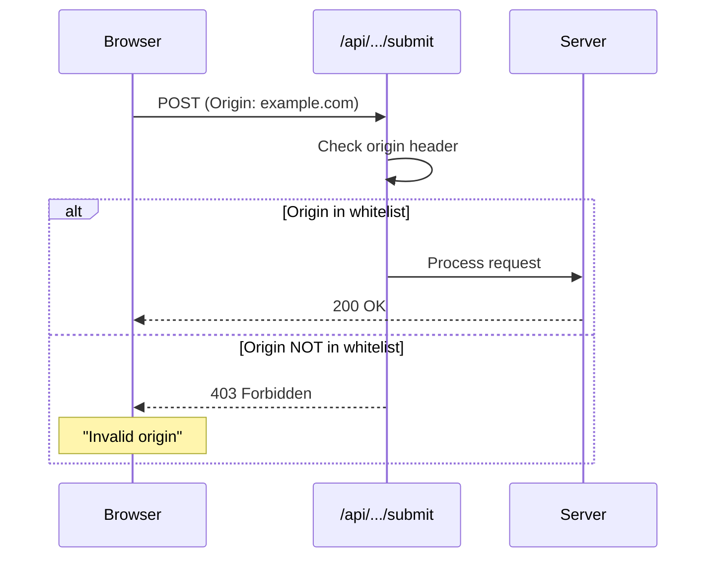
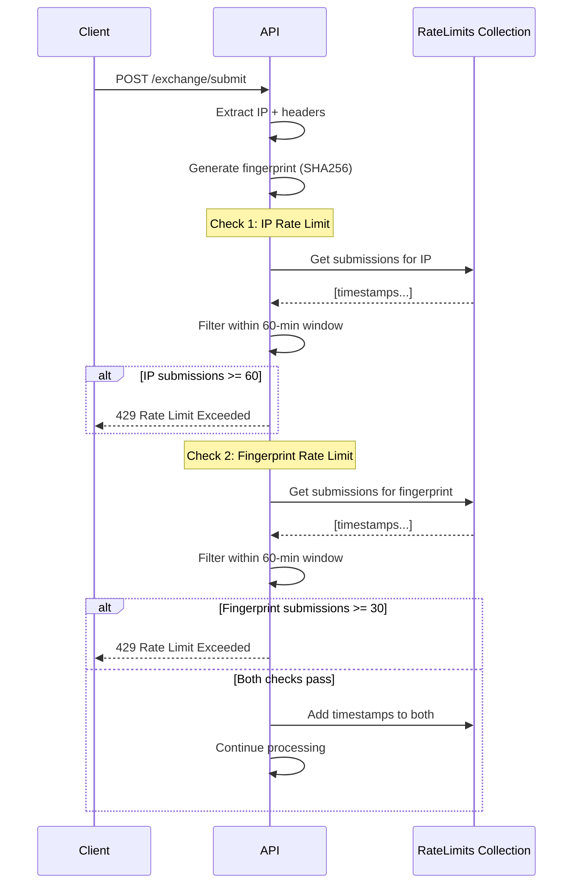
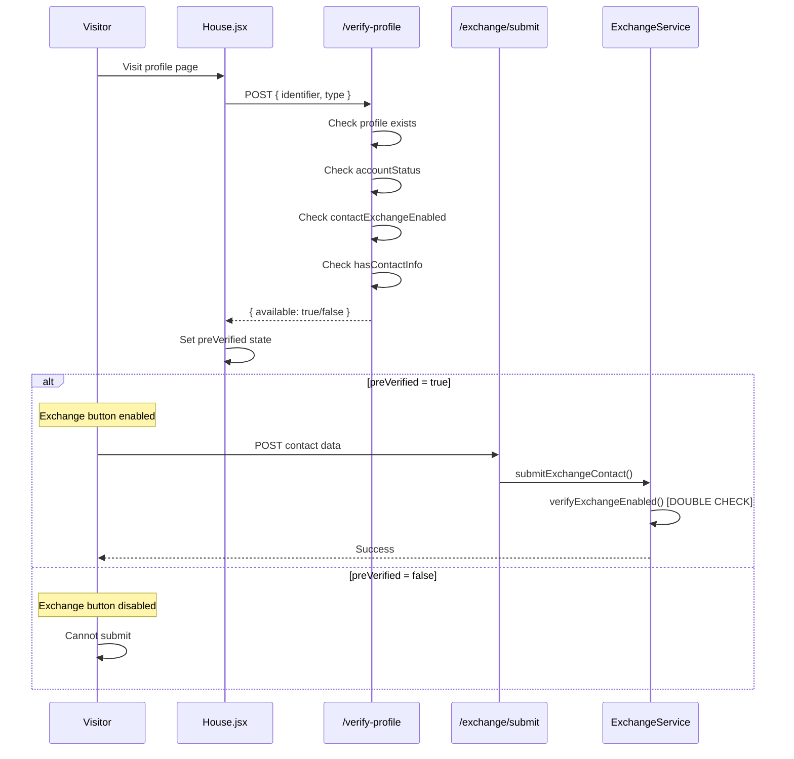
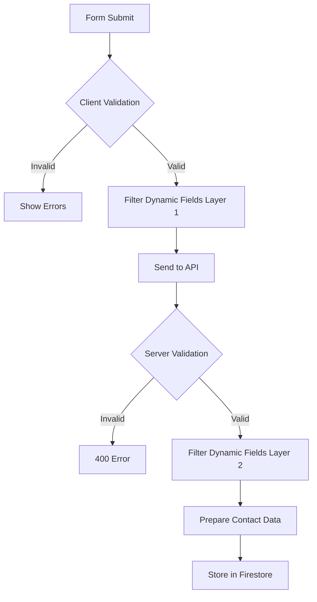
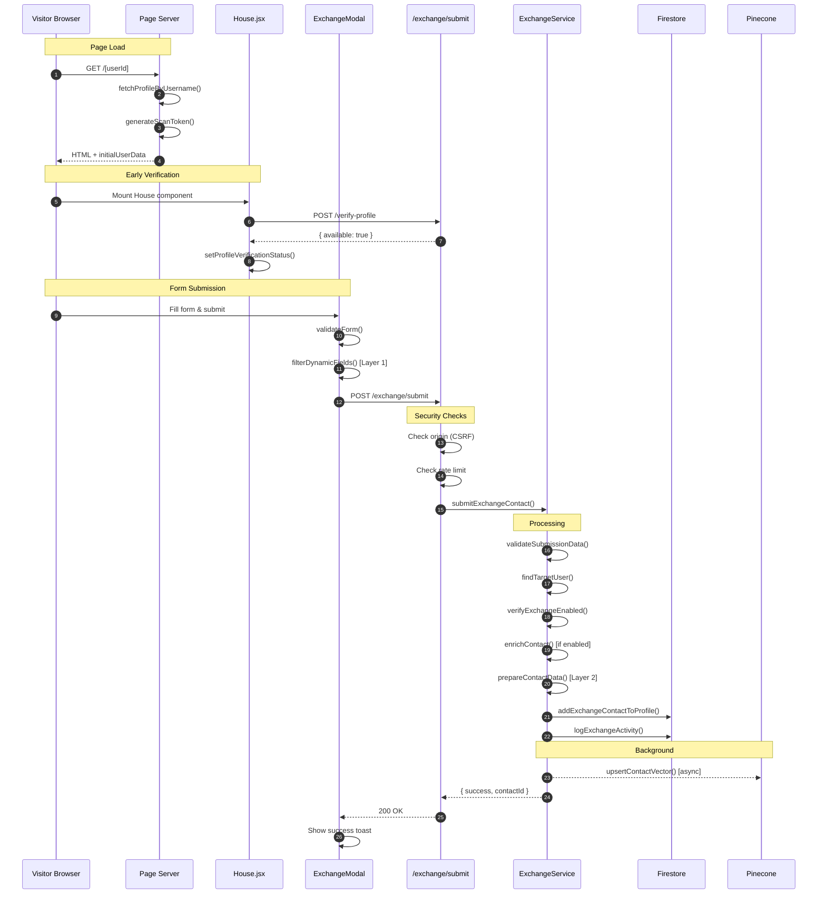
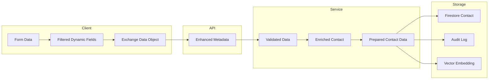
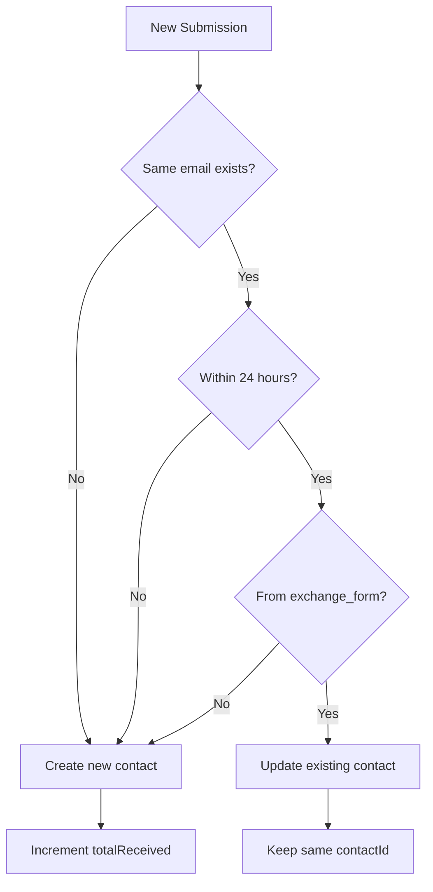
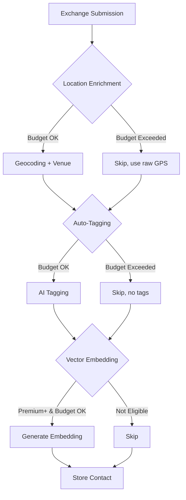

# Exchange Service Security Architecture

## Executive Summary

The Exchange Service is a **PUBLIC-FACING endpoint** that allows anonymous visitors to submit contact information to profile owners. Unlike most API endpoints in Weavink which require Firebase authentication, this service operates without user authentication while maintaining robust security through a **defense-in-depth** approach.

### Key Security Characteristics

| Aspect | Implementation |
|--------|----------------|
| **Authentication** | NOT required - Public endpoint |
| **Authorization** | Target profile settings check |
| **Rate Limiting** | Dual: 60/hr per IP + 30/hr per fingerprint |
| **CSRF Protection** | Origin whitelist validation |
| **Input Validation** | Multi-layer sanitization |
| **Audit Logging** | All submissions logged (IP + fingerprint) |
| **Data Protection** | Duplicate detection, field filtering |

### Why No Authentication?

The exchange service is intentionally designed as a public endpoint because:

1. **Use Case**: Visitors to a user's public profile page need to share their contact information
2. **User Experience**: Requiring login would create friction and defeat the purpose
3. **Business Logic**: The "Visitor → Profile Owner" model requires the visitor to be anonymous

Security is achieved through **other mechanisms** detailed in this document.

---

## Architecture Overview

### Component Map

```mermaid
graph TB
    subgraph "Client Layer"
        A[app/[userId]/page.jsx<br/>Server Component] --> B[app/[userId]/House.jsx<br/>Client Container]
        B --> C[ExchangeButton.jsx]
        B --> D[ExchangeModal.jsx]
    end

    subgraph "Service Layer"
        D --> E[EnhancedExchangeService.js<br/>Client Service]
        E --> F[/api/user/contacts/exchange/submit<br/>API Route]
        E --> G[/api/user/contacts/verify-profile<br/>API Route]
    end

    subgraph "Security Layer"
        F --> H{CSRF Check}
        H --> I{Rate Limit Check}
        I --> J{Profile Authorization}
    end

    subgraph "Processing Layer"
        J --> K[ExchangeService.js<br/>Server Service]
        K --> L[LocationEnrichmentService]
        K --> M[AutoTaggingService]
        K --> N[VectorStorageService]
    end

    subgraph "Storage Layer"
        K --> O[(Firestore: Contacts)]
        K --> P[(Firestore: ExchangeAuditLogs)]
        K --> Q[(Firestore: RateLimits)]
        N --> R[(Pinecone: Vectors)]
    end
```

### File Reference Table

| File | Purpose | Type |
|------|---------|------|
| `app/[userId]/page.jsx:45-95` | Server-side page, generates scan tokens | Server Component |
| `app/[userId]/House.jsx:1-353` | Client container, early verification | Client Component |
| `app/[userId]/components/ExchangeButton.jsx:1-457` | Exchange trigger button | Client Component |
| `app/[userId]/components/ExchangeModal.jsx:1-984` | Exchange form and submission | Client Component |
| `lib/services/serviceContact/client/services/EnhancedExchangeService.js:1-355` | Client-side API wrapper | Client Service |
| `app/api/user/contacts/exchange/submit/route.js:1-132` | Main submission endpoint | API Route |
| `app/api/user/contacts/verify-profile/route.js:1-111` | Profile verification endpoint | API Route |
| `lib/services/serviceContact/server/exchangeService.js:1-602` | Core server-side processing | Server Service |

---

## Security Layer 1: CSRF/Origin Protection

### Purpose
Prevents malicious websites from submitting contacts on behalf of unsuspecting visitors.

### Implementation

**File**: `app/api/user/contacts/exchange/submit/route.js:15-35`

```javascript
// CSRF Protection
const origin = request.headers.get('origin');
const allowedOrigins = [
  process.env.NEXT_PUBLIC_APP_URL,
  process.env.NEXT_PUBLIC_BASE_URL,
  'http://localhost:3000',
  'http://localhost:3001',
  'https://localhost:3000',
  'https://localhost:3001'
];

if (process.env.NODE_ENV === 'development') {
  const isDevelopmentOrigin = origin?.includes('localhost') || origin?.includes('127.0.0.1');
  if (!isDevelopmentOrigin && !allowedOrigins.includes(origin)) {
    console.warn(`🚨 CSRF Warning: Request from invalid origin: ${origin}`);
    return NextResponse.json({ error: 'Invalid origin' }, { status: 403 });
  }
} else if (!allowedOrigins.includes(origin)) {
  console.warn(`🚨 CSRF Warning: Request from invalid origin: ${origin}`);
  return NextResponse.json({ error: 'Invalid origin' }, { status: 403 });
}
```

### Security Flow



### Configuration

| Environment | Allowed Origins |
|-------------|-----------------|
| Production | `NEXT_PUBLIC_APP_URL`, `NEXT_PUBLIC_BASE_URL` |
| Development | All localhost variants (3000, 3001), 127.0.0.1 |

### Attack Mitigation

This protects against:
- **CSRF attacks**: Malicious site cannot forge requests
- **Hotlinking**: External sites cannot embed exchange forms
- **API abuse**: Prevents unauthorized API consumption

---

## Security Layer 2: Dual Rate Limiting (IP + Fingerprint)

### Purpose
Prevents abuse, spam, and denial-of-service attacks using a **defense-in-depth** approach with two complementary rate limits:
1. **IP-based**: Blocks bulk submissions from single IP addresses
2. **Fingerprint-based**: Blocks sophisticated attackers rotating IP addresses

### Implementation

**File**: `lib/services/serviceContact/server/exchangeService.js:488-533`

```javascript
/**
 * Check rate limits for exchange submissions
 */
static async checkExchangeRateLimit(ip, maxSubmissions = 60, windowMinutes = 60) {
  try {
    if (!ip || ip === 'unknown') return true;

    const now = Date.now();
    const windowMs = windowMinutes * 60 * 1000;
    const cacheKey = `exchange_rate_limit_${ip}`;

    const rateLimitDoc = await adminDb.collection('RateLimits').doc(cacheKey).get();

    let submissions = [];
    if (rateLimitDoc.exists) {
      submissions = rateLimitDoc.data().submissions || [];
    }

    // Remove old submissions outside time window
    submissions = submissions.filter(timestamp => now - timestamp < windowMs);

    // Check if limit exceeded
    if (submissions.length >= maxSubmissions) {
      throw new Error(`Exchange rate limit exceeded. Maximum ${maxSubmissions} submissions per ${windowMinutes} minutes.`);
    }

    // Add current submission
    submissions.push(now);

    // Update cache
    await adminDb.collection('RateLimits').doc(cacheKey).set({
      submissions,
      lastUpdated: FieldValue.serverTimestamp(),
      type: 'exchange_submission'
    });

    return true;

  } catch (error) {
    if (error.message.includes('rate limit exceeded')) {
      throw error;
    }

    console.error('❌ ExchangeService: Error checking rate limit:', error);
    // If rate limiting fails, allow the operation (fail open)
    return true;
  }
}
```

### Fingerprint Generation

**File**: `lib/services/serviceContact/server/exchangeService.js:536-549`

The fingerprint combines multiple HTTP headers to create a unique device identifier:

```javascript
/**
 * Generate a fingerprint from request headers for rate limiting
 */
static generateExchangeFingerprint({ ip, userAgent, acceptLanguage, acceptEncoding }) {
  const factors = [
    ip || 'unknown_ip',
    userAgent ? crypto.createHash('md5').update(userAgent).digest('hex').substring(0, 8) : 'unknown_ua',
    acceptLanguage?.split(',')[0]?.trim() || 'unknown_lang',
    acceptEncoding?.substring(0, 20) || 'unknown_enc'
  ].join('::');

  return crypto.createHash('sha256').update(factors).digest('hex').substring(0, 16);
}
```

**Fingerprint Components**:
| Factor | Source | Purpose |
|--------|--------|---------|
| IP Address | `x-forwarded-for` / `x-real-ip` | Primary identifier |
| User Agent Hash | `user-agent` header (MD5, 8 chars) | Browser/device fingerprint |
| Accept-Language | `accept-language` header (first value) | Locale identifier |
| Accept-Encoding | `accept-encoding` header (first 20 chars) | Compression support |

### Fingerprint Rate Limiting

**File**: `lib/services/serviceContact/server/exchangeService.js:551-599`

```javascript
/**
 * Check fingerprint-based rate limits for exchange submissions
 * This complements IP-based rate limiting to catch IP-rotating attackers
 */
static async checkExchangeFingerprintRateLimit(fingerprint, maxSubmissions = 30, windowMinutes = 60) {
  // ... same sliding window pattern as IP rate limit
  // Uses 'exchange_fingerprint_' prefix in RateLimits collection
}
```

### API Route Integration

**File**: `app/api/user/contacts/exchange/submit/route.js:37-66`

```javascript
// Extract request metadata for rate limiting
const forwarded = request.headers.get("x-forwarded-for");
const ip = forwarded ? forwarded.split(",")[0].trim() : request.headers.get("x-real-ip") || 'unknown';
const userAgent = request.headers.get('user-agent') || '';
const acceptLanguage = request.headers.get('accept-language') || '';
const acceptEncoding = request.headers.get('accept-encoding') || '';

// Generate fingerprint for enhanced rate limiting
const fingerprint = ExchangeService.generateExchangeFingerprint({
  ip,
  userAgent,
  acceptLanguage,
  acceptEncoding
});

// Dual rate limiting: IP-based AND fingerprint-based
// Both must pass to continue (defense in depth)
try {
  // Check 1: IP-based rate limit (60 per hour per IP)
  await ExchangeService.checkExchangeRateLimit(ip, 60, 60);

  // Check 2: Fingerprint-based rate limit (30 per hour per device)
  await ExchangeService.checkExchangeFingerprintRateLimit(fingerprint, 30, 60);
} catch (rateLimitError) {
  console.warn(`🚨 Rate limit exceeded - IP: ${ip}, Fingerprint: ${fingerprint}`);
  return NextResponse.json({
    error: rateLimitError.message,
    code: 'RATE_LIMIT_EXCEEDED'
  }, { status: 429 });
}
```

### Dual Rate Limit Flow



### Rate Limit Configuration

| Identifier | Limit | Window | Storage Key | Purpose |
|------------|-------|--------|-------------|---------|
| IP Address | 60/hr | 60 min | `exchange_rate_limit_{ip}` | Block bulk from single IP |
| Fingerprint | 30/hr | 60 min | `exchange_fingerprint_{hash}` | Block IP-rotating attackers |

### IP Address Extraction

The system extracts client IP from multiple headers:

```javascript
// Priority order:
// 1. x-forwarded-for (first IP in chain - original client)
// 2. x-real-ip (set by reverse proxy)
// 3. Fallback to 'unknown'

const forwarded = request.headers.get("x-forwarded-for");
const ip = forwarded ? forwarded.split(",")[0] : request.headers.get("x-real-ip") || 'unknown';
```

### Storage Structure

**Collection**: `RateLimits/{cacheKey}`

```javascript
// IP-based rate limit entry
// Key: exchange_rate_limit_{ip}
{
  submissions: [1732449600000, 1732449660000, ...],  // Timestamps
  lastUpdated: Timestamp,
  type: 'exchange_submission'
}

// Fingerprint-based rate limit entry
// Key: exchange_fingerprint_{16-char-hash}
{
  submissions: [1732449600000, 1732449660000, ...],  // Timestamps
  lastUpdated: Timestamp,
  type: 'exchange_fingerprint'
}
```

### Violation Logging

Rate limit violations are **persistently logged** to the `ExchangeAuditLogs` collection for security monitoring:

```javascript
{
  type: 'rate_limit_exceeded',
  limitType: 'ip' | 'fingerprint',
  ip: '192.168.1.1',
  fingerprint: 'abc123def456',
  userAgent: 'Mozilla/5.0...',
  timestamp: '2025-11-24T20:30:00.000Z',
  success: false,
  error: 'Rate limit exceeded (ip)'
}
```

This enables:
- Tracking repeat offenders by IP/fingerprint
- Identifying attack patterns
- Security alerting on high violation rates

### Fail-Open Design

**Important**: Rate limiting uses a **fail-open** pattern - if the rate limit check fails (e.g., Firestore unavailable), the request is allowed. This prioritizes availability over strict rate limiting.

---

## Security Layer 3: Profile Authorization

### Purpose
Ensures contacts are only submitted to profiles that:
1. Exist in the system
2. Have exchange enabled
3. Are not suspended/deleted
4. Have sufficient profile information

### Implementation

#### Early Verification (Client-Side)

**File**: `app/[userId]/House.jsx:169-211`

```javascript
useEffect(() => {
    const verifyProfileEarly = async () => {
        if (isPreviewMode || !shouldShowContactExchange) {
            setProfileVerificationStatus({ verified: false, loading: false, error: null });
            return;
        }

        try {
            console.log('🔍 House: Early profile verification for contact exchange');
            const { EnhancedExchangeService } = await import('@/lib/services/serviceContact/client/services/EnhancedExchangeService');
            const exchangeService = new EnhancedExchangeService();

            let verification;
            if (userData?.uid) {
                verification = await exchangeService.verifyProfileByUserId(userData.uid);
            } else if (userData?.username) {
                verification = await exchangeService.verifyProfileByUsername(userData.username);
            } else {
                throw new Error('No profile identifier available');
            }

            setProfileVerificationStatus({
                verified: verification.available,
                loading: false,
                error: null
            });

            console.log('✅ House: Profile verification completed:', verification.available);

        } catch (error) {
            console.error('❌ House: Profile verification failed:', error);
            setProfileVerificationStatus({
                verified: false,
                loading: false,
                error: error.message
            });
        }
    };

    if (userData?.uid || userData?.username) {
        verifyProfileEarly();
    }
}, [userData?.uid, userData?.username, isPreviewMode, shouldShowContactExchange]);
```

#### Server-Side Verification

**File**: `app/api/user/contacts/verify-profile/route.js:5-110`

```javascript
export async function POST(request) {
  try {
    const { identifier, type } = await request.json();

    if (!identifier || !type) {
      return NextResponse.json(
        { error: 'Identifier and type are required' },
        { status: 400 }
      );
    }

    let userDoc;

    if (type === 'userId') {
      // Look up by user ID
      userDoc = await adminDb.collection('users').doc(identifier).get();

      if (!userDoc.exists) {
        return NextResponse.json({
          exists: false,
          available: false,
          error: 'Profile not found'
        });
      }
    } else if (type === 'username') {
      // Look up by username (case-insensitive)
      const querySnapshot = await adminDb
        .collection('users')
        .where('username', '==', identifier.trim().toLowerCase())
        .limit(1)
        .get();

      if (querySnapshot.empty) {
        return NextResponse.json({
          exists: false,
          available: false,
          error: 'Profile not found'
        });
      }

      userDoc = querySnapshot.docs[0];
    }

    const userData = userDoc.data();
    const settings = userData.settings || {};

    // Check if user is active
    if (userData.accountStatus === 'suspended' || userData.accountStatus === 'deleted') {
      return NextResponse.json({
        exists: true,
        available: false,
        error: 'Profile is not active'
      });
    }

    // Check if exchange is enabled (default to true)
    const contactExchangeEnabled = settings.contactExchangeEnabled !== false;

    if (!contactExchangeEnabled) {
      return NextResponse.json({
        exists: true,
        available: false,
        error: 'Exchange not enabled for this profile'
      });
    }

    // Check if profile has required info
    const profile = userData.profile || {};
    const hasContactInfo = profile.displayName || userData.email;

    if (!hasContactInfo) {
      return NextResponse.json({
        exists: true,
        available: false,
        error: 'Profile does not have sufficient contact information'
      });
    }

    return NextResponse.json({
      exists: true,
      available: true,
      profile: {
        userId: userDoc.id,
        username: userData.username,
        displayName: profile.displayName || userData.displayName,
        avatarUrl: profile.avatarUrl
      }
    });

  } catch (error) {
    console.error('❌ API: Error verifying profile:', error);
    return NextResponse.json(
      { error: 'Internal server error', message: error.message },
      { status: 500 }
    );
  }
}
```

#### Double Verification on Submission

**File**: `lib/services/serviceContact/server/exchangeService.js:283-298`

```javascript
/**
 * Verify exchange is enabled for target user
 */
static async verifyExchangeEnabled(userId) {
  const userDoc = await adminDb.collection('users').doc(userId).get();

  if (!userDoc.exists) {
    throw new Error('Profile not found');
  }

  const userData = userDoc.data();
  const settings = userData.settings || {};

  if (settings.contactExchangeEnabled === false) {
    throw new Error('Exchange not enabled for this profile');
  }

  return userData;
}
```

### Authorization Flow



### Authorization Checks Summary

| Check | Location | Failure Response |
|-------|----------|------------------|
| Profile exists | verify-profile, exchangeService | `{ exists: false }` or 404 |
| Account not suspended | verify-profile | `{ available: false }` |
| Exchange enabled | verify-profile, exchangeService | 403 EXCHANGE_DISABLED |
| Has contact info | verify-profile | `{ available: false }` |

---

## Security Layer 4: Input Validation & Sanitization

### Purpose
Prevents malicious or malformed data from entering the system through multiple validation layers.

### Client-Side Validation

**File**: `app/[userId]/components/ExchangeModal.jsx:361-376`

```javascript
const validateForm = () => {
    const newErrors = {};

    if (!formData.name.trim()) {
        newErrors.name = t('exchange.name_required') || 'Name is required';
    }

    if (!formData.email.trim()) {
        newErrors.email = t('exchange.email_required') || 'Email is required';
    } else if (!/^[^\s@]+@[^\s@]+\.[^\s@]+$/.test(formData.email)) {
        newErrors.email = t('exchange.email_invalid') || 'Invalid email format';
    }

    setErrors(newErrors);
    return Object.keys(newErrors).length === 0;
};
```

### Server-Side Validation

**File**: `lib/services/serviceContact/server/exchangeService.js:232-252`

```javascript
/**
 * Validate submission data
 */
static validateSubmissionData(submissionData) {
  if (!submissionData || typeof submissionData !== 'object') {
    throw new Error('Submission data must be an object');
  }

  if (!submissionData.contact) {
    throw new Error('Contact data is required');
  }

  const { contact } = submissionData;

  if (!contact.name || !contact.email) {
    throw new Error('Name and email are required');
  }

  if (!submissionData.userId && !submissionData.username) {
    throw new Error('Target profile identifier required');
  }

  return true;
}
```

### Dynamic Field Sanitization (3-Layer Defense)

The system implements a **3-layer defense** to prevent standard fields from leaking into dynamic fields:

#### Layer 1: Client-Side Filtering (ExchangeModal.jsx:400-431)

```javascript
// Filter out any standard fields from dynamicFields before submission
const standardFieldExactMatches = ['name', 'email', 'phone', 'company', 'jobtitle', 'job title', 'website', 'message', 'address', 'id', 'lastmodified', 'submittedat'];

const filteredDynamicFields = dynamicFields.filter(field => {
    const label = field.label?.toLowerCase().trim() || '';

    // Layer 1: Check if explicitly marked as NOT dynamic
    if (field.isDynamic === false) {
        console.warn(`⚠️ Filtered out field "${field.label}" (isDynamic=false) from dynamicFields`);
        return false;
    }

    // Layer 2: Check if marked as standard type
    if (field.type === 'standard') {
        console.warn(`⚠️ Filtered out standard field "${field.label}" (type=standard) from dynamicFields`);
        return false;
    }

    // Layer 3: Check label against known standard field names using EXACT match
    const isStandardField = standardFieldExactMatches.some(stdField => {
        // Exact match only - "company" should not match "company tagline"
        return label === stdField || label === stdField.replace(' ', '');
    });
    if (isStandardField) {
        console.warn(`⚠️ Filtered out standard field "${field.label}" (exact name match) from dynamicFields`);
        return false;
    }

    return true;
});
```

#### Layer 2: Server-Side Filtering (exchangeService.js:316-375)

```javascript
// Ensure dynamicFields is an array and filter out any standard fields that leaked through
const standardFieldExactMatches = ['name', 'email', 'phone', 'company', 'job title', 'jobtitle', 'website', 'message', 'address', 'id', 'lastmodified', 'submittedat', 'status', 'source'];
let cleanedDynamicFields = {};

if (Array.isArray(contact.dynamicFields)) {
  const validFields = contact.dynamicFields.filter(field => {
    if (!field || typeof field !== 'object') {
      console.warn('⚠️ Invalid dynamic field (not an object):', field);
      return false;
    }

    // First check if field has isDynamic=false or type=standard
    if (field.isDynamic === false || field.type === 'standard') {
      console.warn(`⚠️ prepareContactData: Filtered out non-dynamic field "${field.label}"`);
      return false;
    }

    // Check if this field is actually a standard field using EXACT match
    const label = field.label?.toLowerCase().trim() || '';
    const isStandardField = standardFieldExactMatches.some(stdField => {
      return label === stdField || label === stdField.replace(' ', '');
    });

    if (isStandardField) {
      console.warn(`⚠️ prepareContactData: Filtered out standard field "${field.label}" from dynamicFields`);
      return false;
    }

    return true;
  });

  // Convert array to object format
  validFields.forEach(field => {
    const key = field.label
      .split(' ')
      .map((word, index) => {
        word = word.trim();
        return word.charAt(0).toUpperCase() + word.slice(1).toLowerCase();
      })
      .join('');

    cleanedDynamicFields[key] = field.value;
  });
}
```

### URL Normalization

**File**: `app/[userId]/components/ExchangeModal.jsx:277-297`

```javascript
/**
 * Normalize website URL to include protocol
 */
const normalizeWebsiteUrl = (url) => {
    if (!url || typeof url !== 'string') {
        return '';
    }

    const trimmedUrl = url.trim();

    if (trimmedUrl.startsWith('http://') || trimmedUrl.startsWith('https://')) {
        return trimmedUrl;
    }

    if (trimmedUrl.startsWith('www.')) {
        return `https://${trimmedUrl}`;
    }

    if (trimmedUrl.includes('.') && !trimmedUrl.includes(' ')) {
        return `https://${trimmedUrl}`;
    }

    return trimmedUrl;
};
```

### Validation Flow



---

## Security Layer 5: Audit Logging

### Purpose
Creates a complete audit trail of all exchange submissions for:
- Security monitoring
- Abuse detection
- Debugging
- Compliance

### Implementation

**File**: `lib/services/serviceContact/server/exchangeService.js:538-566`

```javascript
/**
 * Log exchange activity
 */
static async logExchangeActivity({ targetUserId, contactId, submissionData, success, error }) {
  try {
    const activityLog = {
      targetUserId,
      contactId: contactId || null,
      success,
      error: error || null,
      timestamp: new Date().toISOString(),
      metadata: {
        targetUsername: submissionData.username || null,
        contactEmail: submissionData.contact?.email || null,
        contactName: submissionData.contact?.name || null,
        hasLocation: !!(submissionData.contact?.location),
        ip: submissionData.metadata?.ip || 'unknown',
        userAgent: submissionData.metadata?.userAgent || 'unknown'
      }
    };

    await adminDb.collection('ExchangeAuditLogs').add(activityLog);

    console.log('📝 ExchangeService: Activity logged:', { targetUserId, success });
    return true;

  } catch (error) {
    console.error('❌ ExchangeService: Error logging activity:', error);
    // Don't throw - audit logging shouldn't break the main operation
    return false;
  }
}
```

### Audit Log Structure

**Collection**: `ExchangeAuditLogs`

```javascript
{
  targetUserId: "firebase_uid",
  contactId: "exchange_1732449600000_abc123def" | null,
  success: true | false,
  error: "Error message" | null,
  timestamp: "2025-11-24T12:00:00.000Z",
  metadata: {
    targetUsername: "johndoe",
    contactEmail: "visitor@example.com",
    contactName: "Jane Smith",
    hasLocation: true | false,
    ip: "192.168.1.1",
    userAgent: "Mozilla/5.0..."
  }
}
```

### Non-Blocking Implementation

**Critical Design Decision**: Audit logging is **non-blocking** - if logging fails, the main operation continues. This ensures:
- User experience is not affected by logging failures
- Submissions don't fail due to audit system issues
- Trade-off: Some audit entries may be lost

### Automatic Cleanup

**File**: `lib/services/serviceContact/server/exchangeService.js:571-600`

```javascript
/**
 * Clean up old exchange audit logs (call periodically)
 */
static async cleanupOldExchangeLogs(daysToKeep = 90) {
  try {
    const cutoffDate = new Date();
    cutoffDate.setDate(cutoffDate.getDate() - daysToKeep);

    const oldLogsQuery = adminDb
      .collection('ExchangeAuditLogs')
      .where('timestamp', '<', cutoffDate.toISOString())
      .limit(500); // Process in batches

    const oldLogsSnapshot = await oldLogsQuery.get();

    if (oldLogsSnapshot.empty) {
      return 0;
    }

    const batch = adminDb.batch();
    oldLogsSnapshot.docs.forEach(doc => {
      batch.delete(doc.ref);
    });

    await batch.commit();

    console.log(`🧹 ExchangeService: Cleaned up ${oldLogsSnapshot.size} old exchange audit logs`);
    return oldLogsSnapshot.size;

  } catch (error) {
    console.error('❌ ExchangeService: Error cleaning up old logs:', error);
    return 0;
  }
}
```

---

## Data Flow: Complete Request Lifecycle

### Sequence Diagram



### Data Transformation



---

## Error Handling & Security Responses

### HTTP Status Codes

| Code | Meaning | When Used |
|------|---------|-----------|
| 200 | Success | Contact submitted successfully |
| 400 | Bad Request | Validation error (missing name/email) |
| 403 | Forbidden | Invalid origin OR exchange disabled |
| 404 | Not Found | Profile doesn't exist |
| 429 | Too Many Requests | Rate limit exceeded |
| 500 | Internal Error | Unexpected server error |

### Error Response Format

**File**: `app/api/user/contacts/exchange/submit/route.js:95-130`

```javascript
// Handle specific error types
if (error.message.includes('not found') || error.message.includes('Profile not found')) {
  return NextResponse.json({
    error: 'Profile not found',
    code: 'PROFILE_NOT_FOUND',
    timing: `${totalTime}ms`
  }, { status: 404 });
}

if (error.message.includes('not enabled') || error.message.includes('Exchange not enabled')) {
  return NextResponse.json({
    error: 'Exchange not enabled for this profile',
    code: 'EXCHANGE_DISABLED',
    timing: `${totalTime}ms`
  }, { status: 403 });
}

if (error.message.includes('required') || error.message.includes('Validation')) {
  return NextResponse.json({
    error: error.message,
    code: 'VALIDATION_ERROR',
    timing: `${totalTime}ms`
  }, { status: 400 });
}

// Generic error (hide details in production)
return NextResponse.json({
  error: 'Failed to submit contact. Please try again.',
  code: 'SUBMISSION_FAILED',
  details: process.env.NODE_ENV === 'development' ? error.message : undefined,
  timing: `${totalTime}ms`
}, { status: 500 });
```

### Information Disclosure Prevention

**Key Security Principle**: Error messages are generic in production to prevent information leakage.

```javascript
// Development: Full error details
details: process.env.NODE_ENV === 'development' ? error.message : undefined

// Production: Generic message only
error: 'Failed to submit contact. Please try again.'
```

---

## Comparison: Exchange vs Protected Routes

### Exchange Service (Public)

```javascript
// app/api/user/contacts/exchange/submit/route.js
export async function POST(request) {
  // NO authentication required

  // Security via:
  // 1. Origin check
  // 2. Rate limiting
  // 3. Profile authorization

  const result = await ExchangeService.submitExchangeContact(submissionData);
}
```

### Protected Route (Authenticated)

```javascript
// Example protected route pattern
export async function GET(request) {
  // Authentication REQUIRED
  const authHeader = request.headers.get('authorization');
  if (!authHeader?.startsWith('Bearer ')) {
    return NextResponse.json({ error: 'Unauthorized' }, { status: 401 });
  }

  const token = authHeader.split('Bearer ')[1];
  const decodedToken = await adminAuth.verifyIdToken(token);
  const userId = decodedToken.uid;

  // Security via:
  // 1. Firebase ID token verification
  // 2. Permission checks
  // 3. Subscription validation

  // ... protected operation
}
```

### Session-Based Protection (lib/server/session.js)

For comparison, here's how protected routes use sessions:

```javascript
export async function createApiSession(request) {
  // 1. AUTHENTICATION
  const authHeader = request.headers.get('authorization');
  if (!authHeader) throw new Error('Authorization required');
  const token = authHeader.substring(7);
  const decodedToken = await adminAuth.verifyIdToken(token);
  const userId = decodedToken.uid;

  // 2. DATA FETCHING
  const subscriptionDetails = await getUserSubscriptionDetails(userId);

  // 3. RETURN SESSION
  return {
    userId,
    subscriptionLevel: subscriptionDetails.subscriptionLevel,
    permissions: subscriptionDetails.permissions,
    limits: subscriptionDetails.limits,
    // ... more context
  };
}
```

### Security Model Comparison

| Aspect | Exchange (Public) | Protected Routes |
|--------|-------------------|------------------|
| Authentication | None | Firebase ID Token |
| User Identification | IP Address | Firebase UID |
| Rate Limiting | Per IP | Per User (optional) |
| Authorization | Profile settings | Permissions + Subscription |
| Audit | IP, User Agent | User ID, Action |
| Session | None | Full session object |

---

## Duplicate Detection

### Purpose
Prevents spam by detecting and updating existing contacts rather than creating duplicates.

### Implementation

**File**: `lib/services/serviceContact/server/exchangeService.js:414-484`

```javascript
/**
 * Add exchange contact to user's profile
 */
static async addExchangeContactToProfile(userId, contactData) {
  const contactsRef = adminDb.collection('Contacts').doc(userId);
  const contactsDoc = await contactsRef.get();

  let existingContacts = [];
  if (contactsDoc.exists) {
    existingContacts = contactsDoc.data().contacts || [];
  }

  // Check for recent duplicate (same email within 24 hours)
  const recentDuplicate = this.findRecentDuplicate(existingContacts, contactData.email);

  if (recentDuplicate) {
    console.log(`⚠️ ExchangeService: Recent duplicate found, updating existing: ${recentDuplicate.id}`);

    const updatedContacts = existingContacts.map(contact =>
      contact.id === recentDuplicate.id
        ? { ...contact, ...contactData, lastModified: new Date().toISOString() }
        : contact
    );

    await contactsRef.update({
      contacts: updatedContacts,
      lastUpdated: FieldValue.serverTimestamp()
    });

    return recentDuplicate.id;
  }

  // Add new contact to the beginning of the array
  const updatedContacts = [contactData, ...existingContacts];

  await contactsRef.set({
    contacts: updatedContacts,
    lastUpdated: FieldValue.serverTimestamp(),
    totalContacts: updatedContacts.length,
    exchange: {
      totalReceived: (contactsDoc.data()?.exchange?.totalReceived || 0) + 1,
      lastExchangeDate: new Date().toISOString(),
    }
  }, { merge: true });

  return contactData.id;
}

/**
 * Find recent duplicate contact
 */
static findRecentDuplicate(existingContacts, email) {
  if (!email) return null;

  const last24Hours = new Date(Date.now() - 24 * 60 * 60 * 1000);

  return existingContacts.find(contact =>
    contact.email === email &&
    contact.source === 'exchange_form' &&
    new Date(contact.submittedAt) > last24Hours
  );
}
```

### Duplicate Logic



---

## Cost & Budget Security

### Purpose
Prevents API cost overruns by checking budgets before expensive operations.

### Budget Pre-flight Checks

```javascript
// Before each enrichment step:
const canAfford = await CostTrackingService.canAffordGeneric(
  userId,
  'ApiUsage',  // or 'AIUsage'
  estimatedCost,
  requiresBillableRun
);

if (!canAfford) {
  // Graceful degradation - skip enrichment, continue with basic contact
}
```

### Graceful Degradation Model



---

## Data Storage Security

### Firestore Collections

#### Contacts/{userId}

```javascript
{
  contacts: [
    {
      id: 'exchange_1732449600000_abc123def',
      name: 'Jane Smith',
      email: 'jane@example.com',
      phone: '+1-555-0123',
      company: 'Acme Corp',
      jobTitle: 'Developer',
      website: 'https://jane.dev',
      message: 'Nice to meet you!',
      location: {
        latitude: 37.7749,
        longitude: -122.4194,
        accuracy: 10,
        address: '123 Main St, San Francisco, CA',
        venue: {
          name: 'Moscone Center',
          placeId: 'ChIJ...',
          type: 'convention_center'
        }
      },
      tags: ['developer', 'networking', 'san-francisco'],
      dynamicFields: {
        'CompanyTagline': 'Building the future',
        'LinkedIn': 'linkedin.com/in/janesmith'
      },
      status: 'new',
      source: 'exchange_form',
      submittedAt: '2025-11-24T12:00:00.000Z',
      lastModified: '2025-11-24T12:00:00.000Z',
      metadata: {
        userAgent: 'Mozilla/5.0...',
        referrer: 'https://google.com',
        sessionId: 'sess_abc123',
        timezone: 'America/Los_Angeles',
        language: 'en-US',
        ip: '192.168.1.1',
        submissionTime: '2025-11-24T12:00:00.000Z',
        hasScannedData: false,
        venue: { /* venue metadata */ },
        budgetExceeded: false,
        enrichmentAttempted: true
      }
    }
  ],
  lastUpdated: Timestamp,
  totalContacts: 42,
  exchange: {
    totalReceived: 15,
    lastExchangeDate: '2025-11-24T12:00:00.000Z'
  }
}
```

#### Security Considerations

| Field | Sensitivity | Storage Duration |
|-------|-------------|------------------|
| IP Address | High | In metadata, 90 days in audit logs |
| User Agent | Medium | In metadata |
| Email | High | Permanent (contact data) |
| Location | High | Optional, user-consented |
| Referrer | Low | In metadata |

---

## Security Recommendations

### Current Security Posture

**Strengths:**
- ✅ Multi-layer defense in depth
- ✅ CSRF protection via origin validation
- ✅ IP-based rate limiting
- ✅ Double verification (early + on submission)
- ✅ Multi-layer input sanitization
- ✅ Comprehensive audit logging
- ✅ Non-blocking audit (availability over strict logging)
- ✅ Budget controls prevent cost abuse
- ✅ Graceful degradation on failures

**Potential Improvements:**
- Consider CAPTCHA for additional bot protection
- Consider fingerprinting for more accurate rate limiting
- Consider webhook notifications for suspicious activity

### Attack Vectors Addressed

| Attack | Mitigation |
|--------|------------|
| CSRF | Origin whitelist |
| DDoS | Rate limiting per IP |
| Spam | Rate limiting + duplicate detection |
| Data injection | Multi-layer validation |
| Information disclosure | Generic error messages |
| Profile enumeration | Consistent response timing |
| Cost abuse | Budget pre-flight checks |

---

## Appendix: Full Request/Response Examples

### Successful Submission

**Request:**
```http
POST /api/user/contacts/exchange/submit HTTP/1.1
Host: app.weavink.com
Origin: https://app.weavink.com
Content-Type: application/json

{
  "userId": "abc123xyz",
  "contact": {
    "name": "Jane Smith",
    "email": "jane@example.com",
    "phone": "+1-555-0123",
    "company": "Acme Corp",
    "jobTitle": "Developer",
    "website": "https://jane.dev",
    "message": "Nice meeting you!",
    "location": {
      "latitude": 37.7749,
      "longitude": -122.4194,
      "accuracy": 10
    },
    "dynamicFields": [
      { "label": "LinkedIn", "value": "linkedin.com/in/jane", "isDynamic": true }
    ]
  },
  "metadata": {
    "userAgent": "Mozilla/5.0...",
    "timezone": "America/Los_Angeles",
    "language": "en-US"
  }
}
```

**Response:**
```json
{
  "success": true,
  "message": "Contact submitted successfully!",
  "contactId": "exchange_1732449600000_abc123def",
  "submittedAt": "2025-11-24T12:00:00.000Z",
  "targetProfile": {
    "userId": "abc123xyz",
    "username": "johndoe",
    "displayName": "John Doe"
  },
  "features": {
    "dynamicFields": 1,
    "hasLocation": true,
    "hasScannedData": false
  },
  "timing": "234ms"
}
```

### Rate Limited

**Response:**
```json
{
  "error": "Exchange rate limit exceeded. Maximum 60 submissions per 60 minutes.",
  "code": "RATE_LIMIT_EXCEEDED"
}
```

### Invalid Origin

**Response:**
```json
{
  "error": "Invalid origin"
}
```

### Exchange Disabled

**Response:**
```json
{
  "error": "Exchange not enabled for this profile",
  "code": "EXCHANGE_DISABLED",
  "timing": "45ms"
}
```

---

## Document Information

| Field | Value |
|-------|-------|
| **ID** | security-exchange-service-001 |
| **Category** | Security |
| **Status** | Active |
| **Created** | 2025-11-24 |
| **Last Updated** | 2025-11-24 |
| **Author** | Documentation Team |

### Related Documentation

- `API Security Explained: Rate Limiting, CORS, SQL Injection, CSRF, XSS & More.md`
- `security_remediation_plan.md`
- Firebase Authentication documentation
- Session management (`lib/server/session.js`)

### Key Files Referenced

| File | Lines Referenced |
|------|------------------|
| `lib/services/serviceContact/server/exchangeService.js` | 1-602 |
| `app/api/user/contacts/exchange/submit/route.js` | 1-132 |
| `app/api/user/contacts/verify-profile/route.js` | 1-111 |
| `app/[userId]/House.jsx` | 1-353 |
| `app/[userId]/page.jsx` | 1-95 |
| `app/[userId]/components/ExchangeModal.jsx` | 1-984 |
| `app/[userId]/components/ExchangeButton.jsx` | 1-457 |
| `lib/services/serviceContact/client/services/EnhancedExchangeService.js` | 1-355 |
| `lib/server/session.js` | 1-702 |
